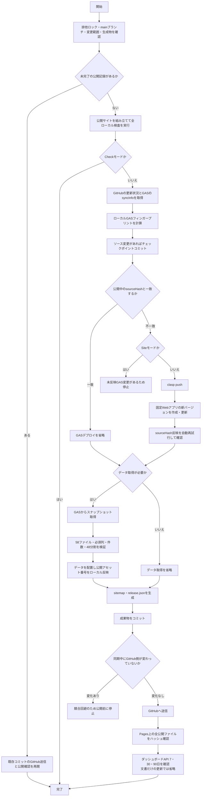

# 日常保守マニュアル

日々のデータ更新、サイト修正、同期、障害対応の手順です。新しいPCの準備は[PC移行マニュアル](PC_MIGRATION_GUIDE.md)、担当者交代は[継承者マニュアル](SUCCESSOR_GUIDE.md)、集計・画面の保守は[ダッシュボードマニュアル](DASHBOARD_GUIDE.md)を参照してください。

## 1. 日常の作業

1. スプレッドシートの用語・訳語など、修正するデータの元を更新します。
2. プロジェクトフォルダで `git status --short` を確認し、意図しない変更がないことを確かめます。
3. `02_RUN_SYNC.bat` を実行します。これは本番公開を伴う操作です。
4. 完了表示と公開サイトの修正箇所を確認します。失敗時は第2章のトラブルシューティングへ進みます。

管理者自身の閲覧を計測から除外する設定は第5章にまとめています。

## 2. データ同期ワークフロー

スプレッドシートから最新データを反映したり、プログラムを更新した場合は、同期スクリプトを使用します。

### 2-1. 同期スクリプトの実行方法
非ITの運用者向けにはプロジェクト直下の `02_RUN_SYNC.bat` をクリックするだけで同期可能ですが、PowerShell から直接コマンドで実行することもできます。
```powershell
# 基本実行（自動コミット）
.\sync-data.ps1

# 任意のコミットメッセージを指定して実行
.\sync-data.ps1 -message "任意の更新メモ"
```

### 2-2. 実行される処理の流れ

通常は従来どおり `02_RUN_SYNC.bat` または `.\sync-data.ps1` の一回実行で最後まで自動で完了します。ブラウザーでの手動確認操作は不要で、ターミナル上に詳細な進捗がカラー表示されます。

分岐を含むフローチャートは本書の付録を参照してください。

1. main・未完了Git操作・変更パス・生成物の手動変更を確認します。自動マージ、自動退避、生成物の自動破棄は行いません。
2. ブラウザー用コードを組み立て、楽譜情報を自動コピーし、JS/CSSの内容ハッシュを各画面に付けます。既存テストと同期の安全性テストを実行します。
3. GitHub認証と公開設定を確認し、ソース変更があればローカルにコミットします。リモートに未取得の変更がある場合は、本番変更前に停止します。
4. GASコードの更新が必要な場合、固定デプロイを更新し、埋め込まれたソースハッシュを確認します。同じコードであればGASの版を追加しません。
5. GASから生成結果を受け取り、実行ID、ソースハッシュ、必須ファイル・列、件数減少、全48実例ファイルと元データの対応を検証します。GASはGitHubへ書き込みません。GitHub認証をGASに送る処理もありません。
6. 全検証に成功してからローカルの生成物を更新し、sitemapと公開ファイルのハッシュ一覧を作成します。
7. 成果物をコミットし、GitHubへ送信します。
8. GitHubへの送信後、最終コミットのPages成功、公開HTML/JS/CSS/JSONの内容一致、ダッシュボードAPI（7/30/90日）を確認して完了します。

#### 更新範囲と確認用モード

| コマンド | 動作 |
| --- | --- |
| `.\sync-data.ps1` | 自動選択。変更なしならシートデータ更新。サイトだけの変更では不要なGAS更新・データ生成を省略 |
| `.\sync-data.ps1 -Mode All` | GASの内容を確認し、データも更新。変更のないGASの版は増やさない |
| `.\sync-data.ps1 -Mode Data` | データ更新。必要なGASコード更新も自動実施 |
| `.\sync-data.ps1 -Mode Site` | サイト更新。GASに未反映の変更がある場合は停止 |
| `.\sync-data.ps1 -Mode Check` | ローカルの組み立て・検証のみ。本番変更なし |
| `.\sync-data.ps1 -Mode Verify` | 未完了の公開・確認を再開。新しい版やコミットは作らない |
| `node scripts/preview-site.js --open` | 現在のローカルデータで目視確認のみ。公開ボタンなし |

空データまたは前回データより30%を超える件数減少は停止します。意図した削除だけ `-AllowDataRemoval` を付けます。必須シートや必須列の欠落はこの指定でも許可しません。

`.sync-state/` はこのPC専用の再開記録です。認証トークンを保存しません。公開待ち・検証失敗で停止した場合、同じコマンドを再実行してください。未完了の公開コミットから安全に確認・公開処理を再開します。

GASへの接続確認と更新直後の反映確認は、Google側の一時的な404や通信失敗を考慮して自動再試行します。更新後は約37秒の待機範囲で反映確認を繰り返します。期限内に確認できなかった場合も、同じコマンドを再実行すれば、すでに反映されたデプロイを検出して版を増やさず再開します。

同じ入力から作るHTMLには実行日時を埋め込まず、毎回同じ内容になるようにします。ローカル検査はデータ出力を2回生成して一致を確認するため、時刻など実行ごとに変わる値を生成物へ追加しないでください。

#### 編集元と実装の分担

| 対象 | 編集元 |
| --- | --- |
| ブラウザーの検索・表示・読み込み・通知 | `frontend/` の各ファイル。`bundle.json` が結合順序 |
| ブラウザーの文字正規化・一致判定 | `frontend/search-core.js` |
| 楽譜メタデータ | `frontend/score-metadata.js`。公開版へのコピーは自動 |
| 辞書HTML | `src/generate_dic_html.js` とシート。公開dic.htmlは直接編集しない |
| 同期 | `scripts/sync/`。PowerShellは入口のみ |
| 公開前確認 | `scripts/preview-site.js` |

`mahler-search-app/js/app.js`、`mahler-search-app/js/score_metadata.js`、`src/sync_build.js` は組み立て結果です。公開アセットの内容ハッシュはローカルで各HTMLへ反映し、GASの変更判定には含めません。利用者向け画面はGitHub Pages版だけを正本とします。GASは同期スナップショット、検索通知、ダッシュボード集計APIを提供し、GAS URLへ通常アクセスした場合はGitHub Pages版へ移動します。GAS側に利用者向けHTMLテンプレートは置かず、Google Sites等へ画面として埋め込みません。

辞書データの通常同期は常に本番の `Notes` を読み込みます。見出し正規化の検証では、生成元内部の `dictionarySource: 'normalizationTest'` を明示した自動テストだけが `Notes_正規化テスト` と `語形対応_正規化テスト` を読み込みます。標準の `sync-data.ps1` はこの指定を送らないため、実験用タブを公開データへ混入させません。

Jevの試験運用は `node scripts/jev-advisory.js --dry-run` で入力・候補・送信形式だけを検証します．確認用レポートはGit管理外の `tmp/jev-advisory-report.json` に出力されます．実APIを試す場合だけ，`.env` または環境変数へ `TYPESAFE_API_KEY` を設定し，`node scripts/jev-advisory.js --live` を実行します．Jevへの送信自体は標準の `sync-data.ps1` や公開検索の応答処理から自動実行しません．既知の見出し・登録済みaliasは通常コードで解決し，検索結果が1件以上ある辞書未登録の検索語だけをJevへ渡します．APIエラーやタイムアウトはレポート上の `SKIPPED` とし，辞書やリンクを変更しません．

Jev判定の保存先には実験用タブ `Jev判定_正規化テスト` を使用します。列は、判定ID、入力語形、文脈、正規化語形、判定経路、処理状態、分類、対応見出し、対応見出しID、分類確信度、対応確信度、候補一覧、人による確認、確認メモ、生成日時の順です。`人による確認` は `未確認`、`採用`、`却下`、`保留` から選択します。ローカルレポートの `sheetExport` も同じ列順で出力します。

実験用バッチへ同タブのA〜O列を見出し行付きJSON行配列として渡す場合は、入力JSONの `reviewSheetRows` に設定するか、`--review-cache <JSONファイル>` を指定します。再利用するのは、`人による確認` が `採用`、`判定経路` が `Jev`、`処理状態` が `ADVISORY` で、分類が `INFLECTION`、`ORTHOGRAPHIC_VARIANT`、`TYPO` のいずれかである行だけです。現在の辞書で対応見出しと見出しIDを再確認し、同じ入力語形の採用行が複数ある場合、対応先が見つからない場合、正規化語形や見出しIDが一致しない場合は再利用せず警告にします。再利用できた語形はJevへ送らず、レポートの `cacheResolutions` に記録します。現段階ではこのタブを標準同期、検索画面、`語形対応_正規化テスト` に自動反映しません。

用語検索で1件以上ヒットしたものの，検索語そのものが辞書の正規見出しにも登録済み語形・別綴りにもない場合は，通常の検索通知とは別の公開POST経路で実験用タブ `検索結果未登録語_正規化テスト` に集約します．0件検索，正規見出し，登録済み語形・別綴り・誤入力はブラウザー側で除外し，検索語，正規化語形，初回・最終検索日時，検索回数，検索ページ，最大検索結果件数だけを保存します．User-Agentは保存せず，メール通知も行いません．同一語は正規化語形をキーとして1行に集約し，短時間の同一送信は `CacheService`，行の更新競合は `LockService` で抑止します．ローカルプレビューと管理者モードでは送信しません．

`未登録語候補_正規化テスト` へ移すのは，`Jev判定_正規化テスト` で `判定経路` が `Jev`，`処理状態` が `ADVISORY`，`分類` が `NEW_TERM_CANDIDATE`，`人による確認` が `採用` の行だけです．管理用の `promoteApprovedNewTermCandidates` は，該当語を正規化語形で照合して1語1行で追加または更新し，観測側を `候補移送済み` にします．この処理は通常の検索，標準同期，辞書生成から自動実行しません．本番の `Notes` へは反映せず，大規模改修の完了後，本番移行直前に別途確認します．

GPT草案は実験用タブ `未登録語候補_正規化テスト` だけで作成します．Apps ScriptのScript Propertiesへ `OPENAI_API_KEY` と `OPENAI_DRAFT_MODEL` を設定し，候補の `状態` を `GPT草案待ち` にしてから，スプレッドシートのメニュー `📝 GPT草案` → `選択行の草案を作成` を実行します．APIキーはシート，ログ，Gitへ保存せず，モデル名もコードへ固定しません．APIへ送信するのは候補の検索語，正規化語形，Jev判定，確信度，類似候補，管理者メモです．管理者メモへ個人情報や秘密情報を記載しないでください．草案はQ～X列へ分けて保存し，Y列に生成日時，Z列にモデル名，AA列に人による確認，AB列に修正メモまたはエラーを記録します．日本語の句読点は保存時に `．` と `，` へ統一します．草案作成に成功すると `状態` は `GPT草案確認中`，`GPT草案状態` は `作成済み` になります．人が内容を修正してAA列を `承認` にしても，本処理は本番の `Notes` へ自動登録しません．本番移行直前の確認と登録は別工程です．

公開用の語形対応データに分類付きで登録された語を検索した場合は、検索結果の先頭に正規見出しとの関係を1行で案内します。格変化・活用形等は「語形」、旧綴り・表記ゆれ等は「別綴り」として表示し、誤入力は検索結果が0件の場合だけ「もしかして：正規見出し」のリンクを表示します。正規見出しそのもの、新規語候補、判断困難、未確認のJev判定には案内を表示しません。検索欄の予測候補は，入力途中でも候補を選べるよう「部分一致／完全一致」の選択とは切り離して常に部分一致で抽出し，検索ボタンを押した後の結果だけに選択中の一致方法を適用します．検索結果内の案内は検索ごとに置き換え、用語集から移動した検索についての固定案内は、利用者が検索欄を手入力・変更した時点で非表示にします。これらはブラウザー内の表示だけで、MailAppの検索通知、検索履歴、`admin=1` / `admin=0` の通知抑止には影響しません。

#### 辞書整備の日常運用

大規模改修中は，実験用タブの内容を標準同期へ混入させません．本番移行では，作業前の版履歴を保存したうえで `Notes_正規化テスト` のA～C列を本番の `Notes` のA～C列へ反映し，`語形対応_正規化テスト` を複製した本番用 `語形対応` タブを作成します．`Notes` のD列以降には触れません．この反映と，`DICTIONARY_EXPORT_SOURCES.production` の切替が済んでも，通常の `sync-data.ps1` を実行するまでは公開サイトのデータと検索挙動は変わりません．

各タブの役割は次のとおりです．

| タブ | 役割 | 人が確認する列 | 本番へ自動反映するか |
| --- | --- | --- | --- |
| `Notes` | 現在の本番辞書 | A～C列を直接確認 | 通常同期で公開する |
| `Notes_正規化テスト` | 正規見出しへ統合した辞書の実験 | A～C列 | しない |
| `語形対応_正規化テスト` | 語形・旧綴り・誤入力と正規見出しの対応 | 対応先と分類 | しない |
| `Jev判定_正規化テスト` | Jevの助言と人の採否 | M列 `人による確認` | しない |
| `検索結果未登録語_正規化テスト` | 1件以上ヒットした辞書未登録の検索語を集約 | 処理状態・備考 | しない |
| `未解決語観測_正規化テスト` | 旧方式の0件検索記録を保存する履歴タブ | 参照のみ | しない |
| `未登録語候補_正規化テスト` | 新規用語候補とGPT草案 | AA列 `草案確認` | しない |

##### `Notes` を直接編集して用語を追加・修正する場合

意味・出典が確認できている用語は，JevやGPTを経由せず，今後も本番の `Notes` を直接編集できます．

1. スプレッドシートの版履歴を確認し，必要なら作業前の状態へ名前を付けます．
2. A列へ正規見出しを1つだけ入力します．単語の見出しでは基本形を採用し，`majestätisch, majestätische` や `markieren, markiert, marcirt, markirt` のように複数の語形をA列へ並べません．二語以上で一つの音楽用語になっている見出しは，そのまま一つの見出しとして保存します．
3. B列へ，日本語の説明本文を既存形式で入力します．語形・別綴りを説明に残す場合も，意味・用法・訳例と一緒に文章として記載します．検索用の対応関係はB列ではなく語形対応タブへ登録します．
4. C列へ出典略記を既存形式で入力します．D列以降は辞書生成に使用しないため，辞書データを追加しません．
5. 日本語を入力する欄では句読点を必ず `．` と `，` に統一します．
6. 同じ正規見出しの行がすでにないか確認します．既存行がある場合は新しい行を作らず，その行へ統合します．
7. 語形・旧綴りからも検索させる場合は，本番移行後の語形対応タブへ「語形・別綴り」「正規見出し」「分類」「備考」を登録します．B列への表示だけでは検索用対応になりません．本番移行前は `語形対応_正規化テスト` で確認します．
8. 公開前に `node scripts/preview-site.js --open` と `./sync-data.ps1 -Mode Check` を実行し，正規見出し，別綴り，実例リンクを確認します．公開してよい段階でだけ通常の `./sync-data.ps1` を実行します．

##### 検索結果にある辞書未登録語を候補として検討する場合

1. 公開の「用語から検索」で1件以上ヒットし，検索語が正規見出しにも登録済み語形にもない場合だけ，`検索結果未登録語_正規化テスト` に同一語ごとに集約されます．0件検索，管理者モード，ローカルプレビューからは送信しません．
2. 通常コード，登録済み語形，人が採用済みのJev判定で解決できない語だけをJevの検討対象にします．`node scripts/jev-advisory.js --dry-run` で送信内容を確認し，必要なときだけ `--live` を実行します．
3. `Jev判定_正規化テスト` のM列は，Jevの分類を人が `採用`，`却下`，`保留` のいずれにするか記録する列です．ここで `採用` にしても本番辞書には登録されません．
4. `NEW_TERM_CANDIDATE` を採用した行だけを管理用処理で `未登録語候補_正規化テスト` へ移します．
5. GPT草案が必要な候補は状態を `GPT草案待ち` にし，対象行を選んで `📝 GPT草案` → `選択行の草案を作成` を実行します．GPTの内容は資料ではなく草案です．辞書，楽譜，信頼できる文献で意味・基本形・語形・出典を人が確認します．
6. AA列は，人が修正後の草案を `承認`，`却下`，`修正中`，`再生成` のいずれにするか記録する列です．`承認` にしても本番の `Notes` へ自動登録されません．
7. 採用する用語は，確認済みの内容だけを前項の手順で `Notes` のA～C列と語形対応へ手動登録します．Jev・GPTの確信度だけを根拠に登録しません．

##### OpenAI API・Jevの課金が発生する操作

OpenAI APIとJevは別サービスであり，残高，請求，APIキーも別管理です．ChatGPTやCodexの利用契約だけでOpenAI APIの利用料金が含まれるとは扱いません．料金単価は変更される可能性があるため本書へ固定せず，実行前後に各サービスの利用画面で確認します．

| 操作 | OpenAI API | Jev |
| --- | --- | --- |
| 公開サイトでの通常検索・実例検索 | 発生しない | 発生しない |
| `sync-data.ps1`，`-Mode Check`，ローカルプレビュー | 発生しない | 発生しない |
| 自動テスト | 発生しない．テスト用の偽応答を使う | 発生しない．テスト用の偽応答を使う |
| シートの閲覧・編集，M列やAA列の選択 | 発生しない | 発生しない |
| `node scripts/jev-advisory.js --dry-run` | 発生しない | 発生しない |
| `node scripts/jev-advisory.js --live` | 発生しない | 辞書未登録の検索語をJevへ送信するたびにクレジットを消費する |
| `📝 GPT草案` → `選択行の草案を作成` | 選択した1候補についてResponses APIを呼び，入力・出力トークン等に応じて課金される | 発生しない |
| GPT草案の再生成 | 再度APIを呼ぶため，再度課金対象になる | 発生しない |

Jevの `--live` は，正規見出しとの完全一致，登録済み語形，人が採用済みの再利用可能な判定をコードで先に除外します．残った辞書未登録の検索語だけを1件ずつ送信します．429・529または通信失敗時は最大3回試行するため，同じ入力が再送される可能性があります．TypeSafeの規約上，アカウントから送信された各Inputがクレジット消費対象です．最終的な消費量は [TypeSafeのBilling画面](https://console.typesafe.ai/settings/billing) で確認してください．残高が0になったとき，自動補充を有効にしていれば購入クレジットが追加され，有効にしていなければ出力が拒否される場合があります．Promotional CreditsとPurchased Creditsでは条件・期限が異なるため，画面に表示される残高と期限を確認します．

GPT草案処理は，入力検査や設定確認だけで終了した場合はAPIを呼びません．API呼出し後は，保存前に失敗しても利用量が発生する可能性があります．通信例外，429，5xxでは最大3回試行するため，複数回のAPI要求になる可能性があります．利用量は [OpenAI Usage](https://platform.openai.com/usage)，請求と残高は [OpenAI Billing](https://platform.openai.com/settings/organization/billing/overview)，現在のモデル単価は [OpenAI API Pricing](https://developers.openai.com/api/docs/pricing) で確認してください．OpenAIはモデルごとの入力・出力トークン等に基づいて課金します．

意図しない消費を防ぐため，Jevは最初に必ず `--dry-run` を使用し，GPT草案は必要な行だけを1行ずつ実行します．自動補充や利用上限は両サービスの請求画面で管理します．APIキーはTypeSafe用を `.env` または環境変数，OpenAI用をApps ScriptのScript Propertiesだけに保存し，シート，ソースコード，ログ，Gitへ記録しません．

##### 本番移行時の確認

本番移行は，この大規模改修の全確認が終わってから別工程で行います．移行時には，次を一つずつ確認します．

1. `Notes` と各実験用タブの作業前スナップショットを保存します．
2. `Notes_正規化テスト` の正規見出し・B列・C列を確認し，本番 `Notes` のA～C列へ移す差分を確定します．
3. 本番用語形対応タブの名称と列構成を確定し，採用済みの語形だけを移します．
4. `DICTIONARY_EXPORT_SOURCES.production.aliasSheetName` を本番用タブへ切り替え，必須タブとして検証する設定にします．この変更が終わるまでは，語形対応の本番移行は完了していません．
5. 自動テスト，`node scripts/check-local.js`，`./sync-data.ps1 -Mode Check`，PC幅・モバイル幅の目視確認を行います．
6. 公開の承認後にだけ通常の `./sync-data.ps1` を実行し，正規見出し，語形案内，実例リンク，管理者モードを公開サイトで確認します．
7. 問題があれば生成物を直接直さず，シートの版履歴または生成元コードを修正して再同期します．

ブラウザー用データは必要なファイルを並行取得し、同時に同じデータを要求しても通信を共有します。同期時のJSONは、検索・実例などの大量データは1行1レコード形式、設定・定義・マニフェスト等のオブジェクトデータは2スペースインデント形式で整形して保存します（エディタでの可読性向上とGit差分の局所化のため）。既存の実例検索の分割方式・検索結果は維持します。

### 2-3. 管理者ダッシュボードとの連携

通常のシート更新ではSitesへの再公開は不要です。同期末尾のAPI検査（7・30・90日）と、所有者画面の「最終更新」を確認します。API・画面の修正、Sites公開、復旧は[ダッシュボードマニュアル](DASHBOARD_GUIDE.md)を参照してください。

### 2-4. 復元手順

* 問題発生時は、作業直前に記録したコミットと公開バージョンを基準に差分を確認してください。過去の特定コミットやSitesバージョン番号を恒久的な復元先にはしません。
* コードを戻す場合は、復元対象のコミットから確認用ブランチを作り、必要な差分だけを通常のコミットとして反映します。作業ツリー全体を消す `git reset --hard` は使用しません。
* ダッシュボードの公開を戻す場合は、Sitesの管理画面で所有者が直前の正常なバージョンを選び、内容と所有者限定設定を確認してから公開します。コードの復元とSitesの公開切替は別作業です。
* GASに問題がある場合は、固定Webアプリのデプロイを直前の正常なコードへ戻してAPI検査を行います。Sitesを戻しただけではGAS APIは戻りません。
* 用語データを戻す場合は `dic.html` や `data/` を直接修正せず、スプレッドシートまたはGASの生成元を修正して `sync-data.ps1` を再実行します。
* 固定GAS WebアプリURLを変更しない限り、ダッシュボード側の `GAS_API_URL` は変更しません。

### 2-5. トラブルシューティング

- 生成物の手動変更で停止：作業内容を別のファイルに保存し、生成元に反映してください。sync-dataが自動的に変更を捨てることはありません。
- main以外・未完了のマージで停止：対象ブランチやGit操作を整理してから再実行してください。
- リモートが先行：ローカル変更をコミットしたうえで `git pull --rebase` を行い、差分を確認して再実行します。
- データ検証で停止：シート名・列名・件数を確認します。検証に失敗した結果は公開しません。
- 公開確認で停止：Gitへの送信とPages公開は別工程です。通常のsync-dataまたは `-Mode Verify` で最終コミットの確認を再開します。
- ダッシュボードだけ失敗：公開結果と区別して未完了を報告します。再実行ではデータ生成やGASの版作成を繰り返しません。
- GAS反映確認で停止：同じsync-dataを再実行します。反映遅延や一時的な通信失敗は自動再試行され、反映済みなら同じデプロイを再利用します。

### 2-6. 保守記録と秘密情報

公開作業ごとに日付、変更内容、コミットID、公開先、確認結果を `CHANGELOG.md` に記録します。ダッシュボードの記録項目は専用マニュアルを参照してください。

`.env`、APIトークン、Googleアカウント情報、Sitesの認証情報はGitへ保存しません。引き継ぎ時は値そのものではなく、保管場所とアクセス権を安全な別経路で共有します。

---

## 3. 楽譜情報の更新手順

ワーグナーおよびシュトラウスの作品検索画面に表示される「楽譜情報（出版社、プレート番号、IMSLPリンク等）」をコード側で更新する手順です。

1. **`frontend/score-metadata.js`** を開き、該当する曲の情報を編集します。
2. 編集後、通常の同期を実行します。公開側へのコピーは同期処理が自動的に行います：
   ```powershell
   .\sync-data.ps1
   ```
3. 同期の完了後、公開サイトで楽譜情報を確認します。公開前に確認したい場合は、先に `node scripts/preview-site.js --open` で表示を確認します。

---

## 4. サイト運用（SEO・パフォーマンス向上）

### 4-1. SEO（検索エンジン最適化）
* **正規タグの設定**: 各 HTML の `<head>` 内に `<link rel="canonical">` および `<meta property="og:url">` が指定され、重複コンテンツを防いでいます。
* **新規ファイル追加時**: `sitemap.xml` への追加に加え、`scripts/sync/artifacts.js` のサイトマップ更新処理と公開対象一覧を確認します。

#### robots.txt とルート用リポジトリ

`https://yutaka-okawachi.github.io/robots.txt` は、ホストのルートに置く必要があるため、専用リポジトリ [yutaka-okawachi/yutaka-okawachi.github.io](https://github.com/yutaka-okawachi/yutaka-okawachi.github.io) で管理します。現在の役割は、`gaswebapp-manual` のサイトマップURLを検索エンジンへ知らせることだけです。

通常のページ追加・本文修正・デザイン変更・検索データ更新では、ルート用リポジトリを変更しません。本リポジトリ側でページ、内部リンク、`sitemap.xml`、必要に応じて `scripts/sync/artifacts.js` の公開対象一覧 を更新します。公開ページをルート用リポジトリへ移す必要はありません。`sync-data.ps1` はルート用リポジトリを更新しません。

ルート用リポジトリを変更するのは、次の場合に限ります。

* サイトマップの公開URLを変更した場合
* `yutaka-okawachi.github.io` ホスト全体のクロール許可・拒否方針を変更する場合
* ホスト名やGitHub Pagesの構成を変更する場合

変更後は、次の2つを別々に確認します。

1. `https://yutaka-okawachi.github.io/robots.txt` がHTTP 200で取得でき、`Sitemap:` 行が正しいこと
2. `https://yutaka-okawachi.github.io/gaswebapp-manual/sitemap.xml` がHTTP 200で取得でき、掲載URLが正しいこと

Google Search Consoleへ `robots.txt` を登録したり、ルート用リポジトリのために新しいプロパティを追加したりする作業はありません。既存のサイトマップが「成功」なら、そのままで構いません。未登録または「取得できませんでした」の場合だけ、既存プロパティの「サイトマップ」から上記のサイトマップURLを1回送信し、後日ステータスを確認します。通常のページ更新ごとに再送信する必要はありません。

### 4-2. パフォーマンス向上 (PageSpeed Insights 対応)
* **フォントの最適化**: ページ読み込み時の LCP（最大コンテンツ描画）遅延を防ぎ、ページ間の見た目を統一するため、トップページ、6つの検索ページ、2つのあらすじページ、用語集では、ページ冒頭の説明、HOMEの各カード内の説明・一覧と注意書き、利用案内、特殊文字の入力方法を案内する枠に、システムのゴシック体を指定しています。共通化できる説明要素には `.page-description` を使用し、「作品を選択」「楽器を選択」などの操作系見出しも同じゴシック体に統一します。用語集の説明文は `src/generate_dic_html.js` を正本とし、生成物の `mahler-search-app/dic.html` は直接編集しません。検索結果と用語検索入力窓は対象外とし、ドイツ語はLora、日本語訳は明朝体を維持します。
* **Googleタグの遅延読み込み**: 描画ブロックを防ぐため、`gtag.js` を即時ロードせず、ページ読み込み後に遅延して追加する実装を行っています。
* **CSSの扱い**: `common.css` は描画ブロック警告が出ることがありますが、レイアウト維持のためにトップページからも単純に削除しないようにしてください。
* **PCの固定検索バー**: サイドバー、ページ本文、法務フッター、フローティング検索バーの左端には、`common.css` の `--sidebar-width` を共通で使用します。固定検索バーだけに個別の幅を設定すると、サイドバーとの間に隙間または重なりが生じるため避けてください。モバイル幅では従来どおり画面幅いっぱいに表示します。
* **「実例を見る」アコーディオンの事前埋め込み方式**:
  巨大な辞書ページ（`dic.html`、1.2MB以上）において、「実例を見る」をクリックした際に動的にDOM要素を生成して挿入すると、ブラウザが大きなレイアウト再計算（リフロー）を引き起こすほか、翻訳ツールや広告ブロックなどの拡張機能が「DOM変更監視（MutationObserver）」によってページ全体を再スscanしてブラウザをフリーズさせる原因になります。
  そのため、アコーディオンで表示するリンク要素は最初から非表示状態（`display: none;`）でHTML内に埋め込んでおき、クリック時は単に `display` スタイルの変更のみを行うようにして、DOMの追加/削除処理を回避しています。
* **「実例を見る」の実利用時間計測**: 用語集から実例検索へ移動する直前の時刻を同一タブ内に一時保存し、検索結果の描画完了時との差をGA4へ送信します。5分を超えた値や検索語・遷移先が一致しない値は破棄し、古い操作や別ページの値が平均へ混ざらないようにしています。
* **「実例を見る」からの画面復帰・強調表示**: 用語集で各作曲家の実例リンクをクリックした際、親行の用語IDをURLハッシュ（`history.replaceState`）および `sessionStorage` に保持します。検索結果画面からブラウザの「戻る」ボタンで復帰した際（BFCache時の `pageshow` を含む）、該当用語のアコーディオンを展開し、`content-visibility: auto` による再レイアウトを考慮した位置合わせ（`scrollToHashTarget`）で画面最上部に復帰させ、検索結果の青い用語リンク遷移と同様に黄色で約2.5秒間強調表示（`.highlight-active`）します。
* **Googleタグ（gtag）のエラー例外保護**:
  プライバシー保護アドオンや広告ブロッカー等によって `window.gtag` の呼び出しが遮断・阻害されることで、JavaScriptの実行エラー（例外）が発生しアコーディオンの開閉処理自体が止まってしまうのを防ぐため、イベント送信部分は必ず `try...catch` 構文で保護しています。

## 5. 管理者ブラウザの解析・検索記録除外

このマニュアルは，サイト管理者自身の検索や閲覧を，通常利用者の利用状況から除外するための「管理者モード」の設定方法を説明します．

管理者モードを有効にしたブラウザでは，検索機能そのものは通常どおり使用できますが，次の処理を停止します．

- Google Analytics 4（GA4）へのアクセス・検索イベント送信
- 検索時のメール通知
- Google スプレッドシート「検索履歴」への記録
- Google スプレッドシート「検索結果未登録語_正規化テスト」への記録

### 5-1. 管理者モードの単位

管理者モードは，端末そのものではなく **ブラウザの保存領域（localStorage）単位** で保存されます．

そのため，次の環境ではそれぞれ一度ずつ設定してください．

- Android スマートフォンの Chrome
- PC の Google Chrome
- PC の Microsoft Edge

同じ PC でも Chrome と Edge は別設定です．Chrome の別プロフィールを使っている場合も，プロフィールごとに設定が必要です．

シークレットモード／InPrivate モードでは保存領域が通常ブラウザと別になるため，日常の管理者利用には通常モードを使用してください．ブラウザの「サイトデータを削除」や localStorage の消去を行うと設定も消えるため，再設定が必要です．

### 5-2. 管理者モードを有効にする

除外したいブラウザで，サイトのルートにある次の推奨 URL を一度開きます．

```text
https://yutaka-okawachi.github.io/gaswebapp-manual/?admin=1
```

ページ右下に次の表示が出れば有効です．

```text
管理者モード：解析・検索記録 OFF
```

`https://yutaka-okawachi.github.io/gaswebapp-manual/index.html?admin=1` を開いても，同じように管理者モードを有効にできます．サイトのルートから設定する上記の形式を通常の案内に使用します．

この設定は `yutaka-okawachi.github.io` 上の本サイトに対してブラウザ内へ保存されるため，以後は通常の URL から検索ページを開いて構いません．`?admin=1` を毎回付ける必要はありません．

### 5-3. PC の Chrome と Edge を両方除外する場合

1. Google Chrome を開き，上記 `?admin=1` URL を開きます．
2. 右下に「管理者モード：解析・検索記録 OFF」と表示されることを確認します．
3. Microsoft Edge を開き，同じ `?admin=1` URL を開きます．
4. Edge 側でも同じ表示を確認します．

Chrome で設定しても Edge には引き継がれません．必ず両方で実行します．

### 5-4. スマートフォンを除外する場合

Android Chrome など，日常的にサイトを確認するスマートフォンのブラウザで同じ `?admin=1` URL を一度開きます．

Wi-Fi とモバイル回線を切り替えても設定は維持されます．IP アドレスではなくブラウザに保存したフラグで判定しているためです．

### 5-5. 動作確認

管理者モードを有効にしたブラウザで検索を1回実行し，次を確認します．

1. 検索結果は通常どおり表示される．
2. 画面右下に「管理者モード：解析・検索記録 OFF」が表示される．
3. 検索通知メールが届かない．
4. スプレッドシートの「検索履歴」に新しい行が追加されない．
5. GA4 のリアルタイム画面に当該ブラウザ由来のアクセスが現れないことを確認する．

GA4 は反映や集計に時間差が生じることがあるため，メール通知と検索履歴の停止も併せて確認してください．

### 5-6. 管理者モードを解除する

通常の利用者として再び計測したいブラウザで，次の URL を一度開きます．

```text
https://yutaka-okawachi.github.io/gaswebapp-manual/?admin=0
```

`https://yutaka-okawachi.github.io/gaswebapp-manual/index.html?admin=0` を開いても，同じように管理者モードを解除できます．

その後ページを再読み込みし，右下の管理者モード表示が消えていることを確認します．

### 5-7. 設定が効かない場合

- `?admin=1` を開いたブラウザと，実際に検索しているブラウザが同じか確認してください．
- Chrome と Edge，通常モードとシークレット／InPrivate は別設定です．
- ブラウザのサイトデータを削除した場合は，再度 `?admin=1` を開いてください．
- ページ右下の管理者モード表示がない場合は，設定が有効になっていないものとして扱ってください．
- GitHub Pages の更新直後は古い JavaScript がキャッシュされる場合があります．その場合はページを再読み込みしてから確認してください．

### 5-8. 実装上の注意

管理者モードのキーは `gmt_admin_device_optout` です．公開サイト側の `mahler-search-app/js/analytics.js` が URL の `admin=1` / `admin=0` を読み取り，localStorage に保存します．

`analytics.js` は Google Analytics のタグより先に読み込まれます．そのため，管理者モードでは GA4 の初期 `page_view` が送信される前に `ga-disable-G-ZT6MPW5MNG` が有効になり，ページ表示・検索結果表示・検索ページ遷移などの GA4 イベントを送信しません．

検索時は検索通知関数と検索結果未登録語の観測関数もブラウザ側で抑止します．検索通知・候補観測リクエスト自体を GAS へ送信しないため，メール通知，Google スプレッドシート「検索履歴」への記録，実験用の検索結果未登録語観測のいずれも実行されません．

公開 HTML と `src/generate_dic_html.js` の GA4 読み込み順は `scripts/normalize-admin-optout.js` で検査・正規化できます．用語集 `dic.html` の再生成元にも同じ読み込み順を反映しているため，通常の `sync-data` によるデータ再生成後も管理者モードが維持される構成です．

この機能は管理者自身のデータを利用統計へ混ぜないことを目的とした運用機能です．一般利用者向けの検索動作や検索結果には影響しません．

## 付録：同期の処理フロー

`sync-data.ps1` は、ローカル検査、必要なGAS更新、データ生成、GitHub Pages公開、公開後確認を一回の実行で行います。ブラウザーでの確認操作はありません。



### GASデプロイの判定

GASデプロイは毎回更新されません。`src/` にある実際のGAS実行ソースからSHA-256フィンガープリントを作り、公開中の固定Webアプリが `syncInfo` で返す `sourceHash` と比較します。

| 状況 | GASデプロイ | データ取得 |
| --- | --- | --- |
| 変更なしで通常実行 | 省略 | 実行 |
| `frontend/`、公開HTML、CSSだけを変更 | 省略 | 省略 |
| マニュアルだけを変更 | 省略 | 省略 |
| `src/` のGAS実行ソースを変更 | 更新 | 実行 |
| `-Mode Data` / `-Mode All` でGASが同一 | 省略 | 実行 |
| `-Mode Site` で未反映のGAS変更あり | 更新せず停止 | 実行しない |
| `-Mode Verify` | 更新しない | 再取得しない |

`manage_deploy.js`、`update_env.js`、自動生成される `sync_build.js` はフィンガープリントの対象外です。公開画面のアセット番号もローカルでHTMLへ反映するため、公開画面だけの変更でGAS版が増えることはありません。

GAS更新後の応答が一時的に404になる場合は自動再試行します。再実行時に期待する `sourceHash` がすでに公開されていれば、そのデプロイを再利用し、新しい版を作りません。
