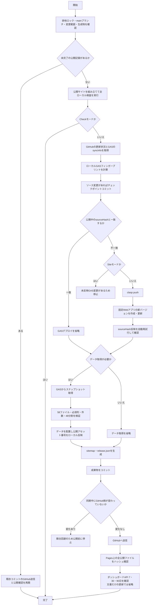

# 日常保守マニュアル

日々のデータ更新、サイト修正、同期、障害対応の手順です。新しいPCの準備は[PC移行マニュアル](PC_MIGRATION_GUIDE.md)、担当者交代は[継承者マニュアル](SUCCESSOR_GUIDE.md)、集計・画面の保守は[ダッシュボードマニュアル](DASHBOARD_GUIDE.md)を参照してください。

## 1. 日常の作業

1. スプレッドシートの用語・訳語など、修正するデータの元を更新します。
2. プロジェクトフォルダで `git status --short` を確認し、意図しない変更がないことを確かめます。
3. `02_RUN_SYNC.bat` を実行します。これは本番公開を伴う操作です。
4. 完了表示と公開サイトの修正箇所を確認します。失敗時は第2章のトラブルシューティングへ進みます。

管理者自身の閲覧を計測から除外する設定は第5章にまとめています。

## 2. データ同期ワークフロー

スプレッドシートから最新データを反映したり、プログラムを更新した場合は、同期スクリプトを使用します。

### 2-1. 同期スクリプトの実行方法
非ITの運用者向けにはプロジェクト直下の `02_RUN_SYNC.bat` をクリックするだけで同期可能ですが、PowerShell から直接コマンドで実行することもできます。
```powershell
# 基本実行（自動コミット）
.\sync-data.ps1

# 任意のコミットメッセージを指定して実行
.\sync-data.ps1 -message "任意の更新メモ"
```

### 2-2. 実行される処理の流れ

通常は従来どおり `02_RUN_SYNC.bat` または `.\sync-data.ps1` の一回実行で最後まで自動で完了します。ブラウザーでの手動確認操作は不要で、ターミナル上に詳細な進捗がカラー表示されます。

分岐を含むフローチャートは本書の付録を参照してください。

1. main・未完了Git操作・変更パス・生成物の手動変更を確認します。自動マージ、自動退避、生成物の自動破棄は行いません。
2. ブラウザー用コードを組み立て、楽譜情報を自動コピーし、JS/CSSの内容ハッシュを各画面に付けます。既存テストと同期の安全性テストを実行します。
3. GitHub認証と公開設定を確認し、ソース変更があればローカルにコミットします。リモートに未取得の変更がある場合は、本番変更前に停止します。
4. GASコードの更新が必要な場合、固定デプロイを更新し、埋め込まれたソースハッシュを確認します。同じコードであればGASの版を追加しません。
5. GASから生成結果を受け取り、実行ID、ソースハッシュ、必須ファイル・列、件数減少、全48実例ファイルと元データの対応を検証します。GASはGitHubへ書き込みません。GitHub認証をGASに送る処理もありません。
6. 全検証に成功してからローカルの生成物を更新し、sitemapと公開ファイルのハッシュ一覧を作成します。
7. 成果物をコミットし、GitHubへ送信します。
8. GitHubへの送信後、最終コミットのPages成功、公開HTML/JS/CSS/JSONの内容一致、ダッシュボードAPI（7/30/90日）を確認して完了します。

#### 更新範囲と確認用モード

| コマンド | 動作 |
| --- | --- |
| `.\sync-data.ps1` | 自動選択。変更なしならシートデータ更新。サイトだけの変更では不要なGAS更新・データ生成を省略 |
| `.\sync-data.ps1 -Mode All` | GASの内容を確認し、データも更新。変更のないGASの版は増やさない |
| `.\sync-data.ps1 -Mode Data` | データ更新。必要なGASコード更新も自動実施 |
| `.\sync-data.ps1 -Mode Site` | サイト更新。GASに未反映の変更がある場合は停止 |
| `.\sync-data.ps1 -Mode Check` | ローカルの組み立て・検証のみ。本番変更なし |
| `.\sync-data.ps1 -Mode Verify` | 未完了の公開・確認を再開。新しい版やコミットは作らない |
| `node scripts/preview-site.js --open` | 現在のローカルデータで目視確認のみ。公開ボタンなし |

空データまたは前回データより30%を超える件数減少は停止します。意図した削除だけ `-AllowDataRemoval` を付けます。必須シートや必須列の欠落はこの指定でも許可しません。

`.sync-state/` はこのPC専用の再開記録です。認証トークンを保存しません。公開待ち・検証失敗で停止した場合、同じコマンドを再実行してください。未完了の公開コミットから安全に確認・公開処理を再開します。

GASへの接続確認と更新直後の反映確認は、Google側の一時的な404や通信失敗を考慮して自動再試行します。更新後は約37秒の待機範囲で反映確認を繰り返します。期限内に確認できなかった場合も、同じコマンドを再実行すれば、すでに反映されたデプロイを検出して版を増やさず再開します。

同じ入力から作るHTMLには実行日時を埋め込まず、毎回同じ内容になるようにします。ローカル検査はデータ出力を2回生成して一致を確認するため、時刻など実行ごとに変わる値を生成物へ追加しないでください。

#### 編集元と実装の分担

| 対象 | 編集元 |
| --- | --- |
| ブラウザーの検索・表示・読み込み・通知 | `frontend/` の各ファイル。`bundle.json` が結合順序 |
| ブラウザーの文字正規化・一致判定 | `frontend/search-core.js` |
| 楽譜メタデータ | `frontend/score-metadata.js`。公開版へのコピーは自動 |
| 辞書HTML | `src/generate_dic_html.js` とシート。公開dic.htmlは直接編集しない |
| 同期 | `scripts/sync/`。PowerShellは入口のみ |
| 公開前確認 | `scripts/preview-site.js` |

`mahler-search-app/js/app.js`、`mahler-search-app/js/score_metadata.js`、`src/sync_build.js` は組み立て結果です。公開アセットの内容ハッシュはローカルで各HTMLへ反映し、GASの変更判定には含めません。利用者向け画面はGitHub Pages版だけを正本とします。GASは同期スナップショット、検索通知、ダッシュボード集計APIを提供し、GAS URLへ通常アクセスした場合はGitHub Pages版へ移動します。GAS側に利用者向けHTMLテンプレートは置かず、Google Sites等へ画面として埋め込みません。

ブラウザー用データは必要なファイルを並行取得し、同時に同じデータを要求しても通信を共有します。同期時のJSONは、検索・実例などの大量データは1行1レコード形式、設定・定義・マニフェスト等のオブジェクトデータは2スペースインデント形式で整形して保存します（エディタでの可読性向上とGit差分の局所化のため）。既存の実例検索の分割方式・検索結果は維持します。

#### 辞書候補ワークフロー

検索語の観測，Jev判定，草案作成は候補タブで行います．人が確認してから `Notes` または `語形対応` に反映します．シートを更新しただけでは公開サイトは変わらず，通常の `sync-data.ps1` が必要です．

`Notes` の見出しは，明示的に統合した項目を除き，元の見出しを保持します．例えば `Abstufungen` を `Abstufung` に置き換えず，`語形対応` のA列を `Abstufungen`，B列を関連語形 `Abstufung` とします．B列の語を用語検索したときはA列の見出しへ移動し，「実例を見る」では両方の語形を検索対象に含めます．関連語形にも独立見出しがある場合は，その独立見出しを優先します．

`Notes` のA～C列は見出し・本文・出典です．D列以降の既存データも行と一緒に保持します．`語形対応` のA～F列は `見出し`，`関連語形`，`語形区分`，`用語検索`，`実例検索`，`補足` です．`sync-data` は `Notes` と `語形対応` を読みます．

GM・RW・RSの「用語から検索」には，辞書の「実例を見る」から移動した場合，見出し語と登録済みの語形・別綴りを検索する短い案内を表示します．検索欄を編集したときはこの案内を隠し，通常検索に戻します．検索欄から直接検索した場合は，関連語形の案内を表示せず，入力語に一致する実例だけを検索します．対応表にない語形は自動推定しません．

| タブ | 役割 | 通常検索から自動更新するか |
| --- | --- | --- |
| `検索結果未登録語` | 用語検索で1件以上ヒットしたが，検索語そのものが辞書見出し・登録済み関連語形にない場合の観測先 | 更新する |
| `Jev判定` | Jevの分類助言とM列 `人による確認` による採否 | 更新しない |
| `語形対応` | 人が採用した関連語形と検索範囲 | 更新しない．明示操作で反映する |
| `未登録語候補` | 人が採用した新規用語候補とOpenAI草案 | 更新しない．明示操作で反映する |
| `未解決語観測_正規化テスト` | 0件検索を集めていた旧方式の履歴．将来の再判定・新方式との比較検証に使えるよう列構成を保持する | 通常検索からは更新しない |

公開検索から自動記録するのは候補観測までです．Jevは課金を伴うため，検索のたびに自動実行しません．また，Jevの出力だけで関連語形や新規用語を採用しません．

#### 対話形式の操作

スプレッドシートを再読み込みし，`📚 辞書候補` → `未登録語を対話形式で処理` を開きます．直近100件の観測から1件を選択すると，検索語，検索ページ，検索件数，取得できたドイツ語の文脈を確認できます．公開検索からダイアログは自動表示されません．

この画面にはApps Scriptの `script.container.ui` スコープを使用します．導入後，最初の実行時にGoogleの再承認画面が出る場合があります．これはスプレッドシート内でダイアログを表示するための権限であり，API課金や本番用Notesへの書込みを許可する操作ではありません．

画面は「観測の確認 → Jev判定 → 人による採否・分類の確認 → その1件だけを移送 → 新規見出しの場合は草案確認 → `Notes` への登録」の順に進みます．JevとOpenAI APIによる草案生成はそれぞれ任意で，実行ボタンの後に課金可能性を示す確認画面が出ます．確認を拒否してもAPIは呼び出しません．OpenAIの草案にはスクリプト プロパティの `OPENAI_API_KEY` と `OPENAI_DRAFT_MODEL` を使用します．キーはダイアログやセルに表示しません．通信の成否が不明な場合は候補行を `結果要確認` とし，API利用状況を確認するまで再実行しません．草案はAPIを使わず手動入力することもできます．

人による採否はダイアログから `Jev判定` のM列へ保存します．「採用」を選んだだけでは移送せず，次の確認操作で選択中の1件のみ `語形対応` または `未登録語候補` へ移します．新規見出しでは英語・イタリア語の類語，原形・語形の記述，一般的な意味を本質的に異なる意味ごとに1行ずつ，音楽用語としての訳例を入力・確認します．B列本文は類語行→日本語による語形説明→【一般的な意味】①②…→【音楽用語としての訳例】の順に組み立てます．例えば `Seite は女性名詞の単数主格（die Seite）．単数属格は der Seite，複数主格は die Seiten．` のように記し，`Substantiv，feminin．die Seite，der Seite，die Seiten` のようなドイツ語ラベルと語形の羅列は保存・登録時に拒否します．RS・RW・GMの実例を見出しごとに調査し，該当するものだけをC列へ `[RS: Oper], [GM], [RW: Oper]` のように半角カンマ区切りで自動設定します．該当する実例を確認できない場合は登録しません．コメントは任意入力のみで，AIの未確認事項や説明は自動挿入しません．最終画面でB列本文・自動調査されるC列出典を確認してから `Notes` へ見出し順に挿入します．行挿入ではD列以降の既存データも同じ行と一緒に移動します．類語や格変化形，複数形は根拠なく補いません．既存見出しと同じ正規化語形は登録を拒否します．公開サイトには通常の `sync-data` を実行するまで反映されません．

Notesから登録済み見出しを削除してやり直す場合は，同じ検索語を対話画面で選び，「この候補の編集を再開する」を押します．既存のJev判定と旧草案は残し，APIは自動的に再実行しません．見出しがNotesに残っている場合は再開できません．

1. GM・RS・RWの「用語から検索」で，検索結果が1件以上あり，検索語が辞書見出し・登録済み関連語形にない場合だけ，`検索結果未登録語` へ同一正規化語形ごとに集約します．0件検索では記録しません．管理者モードでは既定で記録せず，5-2節の明示的な候補観測ON時だけ記録します．
2. GASのApps Script画面で，スクリプト プロパティ `TYPESAFE_API_KEY` にJevのAPIキーを設定します．PCの `.env` はGASへ自動転送されません．キーはシートのセルやコードには入力しません．`検索結果未登録語` の判定したい1行を選択し，`📚 辞書候補` → `選択行をJevで判定` を実行します．実例の文脈を取得できた場合に限り，確認画面で「はい」を選ぶと，その1語についてJev APIの呼出しが1回行われ，課金が発生する可能性があります．文脈を取得できなければ，課金前に停止します．通常検索・通常同期からJevは自動実行されません．
3. 成功すると，`Jev判定` に判定が1行追加され，元の観測行は `Jev判定済み` となりJ列に判定IDが入ります．同じ観測の再実行は抑止します．API通信・応答・保存で失敗したときは観測行を `Jev判定待ち` のまま残します．呼出しが課金されたか不明な場合があるため，API利用状況と判定タブを確認するまで再実行しないでください．
4. 人が分類・対応見出し・確信度を確認し，M列を `採用`，`却下`，`保留` のいずれかにします．
5. 対話画面で採用済みの1件だけを移送します．`INFLECTION`，`ORTHOGRAPHIC_VARIANT`，`TYPO` は `語形対応` へ，`NEW_TERM_CANDIDATE` は `未登録語候補` へ移します．一括反映メニューは本番移行時に除きました．
6. `語形対応` ではA列とB列の組合せを重複追加しません．`INFLECTION` は自動処理だけで格変化形・複数形・活用形等を断定せず，C列を `語形変化（要分類）` として人の確認を残します．
7. 新規用語は草案・B列本文・出典を確認してから `Notes` に見出し順で登録します．公開サイトに反映する時点で通常の `sync-data.ps1` を実行します．

`未解決語観測_正規化テスト` は旧方式の空のタブとして残します．将来の再検討時も，新方式の1件以上ヒットした観測と混在させません．

従来の `Notes_正規化テスト` と `辞書語形・検索対応_実験` は本番移行後に削除しました．過去の実験プレビュー用スクリプトは，入力データを別途保存している場合の再現用であり，通常運用には使用しません．

この経路はメール通知と本番の検索履歴から独立しています．同一イベントの短時間重複は `CacheService`，行更新の競合は `LockService` で抑止します．観測にはUser-Agentを保存しません．

### 2-3. 管理者ダッシュボードとの連携

通常のシート更新ではSitesへの再公開は不要です。同期末尾のAPI検査（7・30・90日）と、所有者画面の「最終更新」を確認します。API・画面の修正、Sites公開、復旧は[ダッシュボードマニュアル](DASHBOARD_GUIDE.md)を参照してください。

### 2-4. 復元手順

* 問題発生時は、作業直前に記録したコミットと公開バージョンを基準に差分を確認してください。過去の特定コミットやSitesバージョン番号を恒久的な復元先にはしません。
* コードを戻す場合は、復元対象のコミットから確認用ブランチを作り、必要な差分だけを通常のコミットとして反映します。作業ツリー全体を消す `git reset --hard` は使用しません。
* ダッシュボードの公開を戻す場合は、Sitesの管理画面で所有者が直前の正常なバージョンを選び、内容と所有者限定設定を確認してから公開します。コードの復元とSitesの公開切替は別作業です。
* GASに問題がある場合は、固定Webアプリのデプロイを直前の正常なコードへ戻してAPI検査を行います。Sitesを戻しただけではGAS APIは戻りません。
* 用語データを戻す場合は `dic.html` や `data/` を直接修正せず、スプレッドシートまたはGASの生成元を修正して `sync-data.ps1` を再実行します。
* 固定GAS WebアプリURLを変更しない限り、ダッシュボード側の `GAS_API_URL` は変更しません。

### 2-5. トラブルシューティング

- 生成物の手動変更で停止：作業内容を別のファイルに保存し、生成元に反映してください。sync-dataが自動的に変更を捨てることはありません。
- main以外・未完了のマージで停止：対象ブランチやGit操作を整理してから再実行してください。
- リモートが先行：ローカル変更をコミットしたうえで `git pull --rebase` を行い、差分を確認して再実行します。
- データ検証で停止：シート名・列名・件数を確認します。検証に失敗した結果は公開しません。
- 公開確認で停止：Gitへの送信とPages公開は別工程です。通常のsync-dataまたは `-Mode Verify` で最終コミットの確認を再開します。
- ダッシュボードだけ失敗：公開結果と区別して未完了を報告します。再実行ではデータ生成やGASの版作成を繰り返しません。
- GAS反映確認で停止：同じsync-dataを再実行します。反映遅延や一時的な通信失敗は自動再試行され、反映済みなら同じデプロイを再利用します。

### 2-6. 保守記録と秘密情報

公開作業ごとに日付、変更内容、コミットID、公開先、確認結果を `CHANGELOG.md` に記録します。ダッシュボードの記録項目は専用マニュアルを参照してください。

`.env`、APIトークン、Googleアカウント情報、Sitesの認証情報はGitへ保存しません。引き継ぎ時は値そのものではなく、保管場所とアクセス権を安全な別経路で共有します。

---

## 3. 楽譜情報の更新手順

ワーグナーおよびシュトラウスの作品検索画面に表示される「楽譜情報（出版社、プレート番号、IMSLPリンク等）」をコード側で更新する手順です。

1. **`frontend/score-metadata.js`** を開き、該当する曲の情報を編集します。
2. 編集後、通常の同期を実行します。公開側へのコピーは同期処理が自動的に行います：
   ```powershell
   .\sync-data.ps1
   ```
3. 同期の完了後、公開サイトで楽譜情報を確認します。公開前に確認したい場合は、先に `node scripts/preview-site.js --open` で表示を確認します。

---

## 4. サイト運用（SEO・パフォーマンス向上）

### 4-1. SEO（検索エンジン最適化）
* **正規タグの設定**: 各 HTML の `<head>` 内に `<link rel="canonical">` および `<meta property="og:url">` が指定され、重複コンテンツを防いでいます。
* **新規ファイル追加時**: `sitemap.xml` への追加に加え、`scripts/sync/artifacts.js` のサイトマップ更新処理と公開対象一覧を確認します。

#### robots.txt とルート用リポジトリ

`https://yutaka-okawachi.github.io/robots.txt` は、ホストのルートに置く必要があるため、専用リポジトリ [yutaka-okawachi/yutaka-okawachi.github.io](https://github.com/yutaka-okawachi/yutaka-okawachi.github.io) で管理します。現在の役割は、`gaswebapp-manual` のサイトマップURLを検索エンジンへ知らせることだけです。

通常のページ追加・本文修正・デザイン変更・検索データ更新では、ルート用リポジトリを変更しません。本リポジトリ側でページ、内部リンク、`sitemap.xml`、必要に応じて `scripts/sync/artifacts.js` の公開対象一覧 を更新します。公開ページをルート用リポジトリへ移す必要はありません。`sync-data.ps1` はルート用リポジトリを更新しません。

ルート用リポジトリを変更するのは、次の場合に限ります。

* サイトマップの公開URLを変更した場合
* `yutaka-okawachi.github.io` ホスト全体のクロール許可・拒否方針を変更する場合
* ホスト名やGitHub Pagesの構成を変更する場合

変更後は、次の2つを別々に確認します。

1. `https://yutaka-okawachi.github.io/robots.txt` がHTTP 200で取得でき、`Sitemap:` 行が正しいこと
2. `https://yutaka-okawachi.github.io/gaswebapp-manual/sitemap.xml` がHTTP 200で取得でき、掲載URLが正しいこと

Google Search Consoleへ `robots.txt` を登録したり、ルート用リポジトリのために新しいプロパティを追加したりする作業はありません。既存のサイトマップが「成功」なら、そのままで構いません。未登録または「取得できませんでした」の場合だけ、既存プロパティの「サイトマップ」から上記のサイトマップURLを1回送信し、後日ステータスを確認します。通常のページ更新ごとに再送信する必要はありません。

### 4-2. パフォーマンス向上 (PageSpeed Insights 対応)
* **フォントの最適化**: ページ読み込み時の LCP（最大コンテンツ描画）遅延を防ぎ、ページ間の見た目を統一するため、トップページ、6つの検索ページ、2つのあらすじページ、用語集では、ページ冒頭の説明、HOMEの各カード内の説明・一覧と注意書き、利用案内、特殊文字の入力方法を案内する枠に、システムのゴシック体を指定しています。共通化できる説明要素には `.page-description` を使用し、「作品を選択」「楽器を選択」などの操作系見出しも同じゴシック体に統一します。用語集の説明文は `src/generate_dic_html.js` を正本とし、生成物の `mahler-search-app/dic.html` は直接編集しません。検索結果と用語検索入力窓は対象外とし、ドイツ語はLora、日本語訳は明朝体を維持します。
* **Googleタグの遅延読み込み**: 描画ブロックを防ぐため、`gtag.js` を即時ロードせず、ページ読み込み後に遅延して追加する実装を行っています。
* **CSSの扱い**: `common.css` は描画ブロック警告が出ることがありますが、レイアウト維持のためにトップページからも単純に削除しないようにしてください。
* **PCの固定検索バー**: サイドバー、ページ本文、法務フッター、フローティング検索バーの左端には、`common.css` の `--sidebar-width` を共通で使用します。固定検索バーだけに個別の幅を設定すると、サイドバーとの間に隙間または重なりが生じるため避けてください。モバイル幅では従来どおり画面幅いっぱいに表示します。
* **「実例を見る」アコーディオンの事前埋め込み方式**:
  巨大な辞書ページ（`dic.html`、1.2MB以上）において、「実例を見る」をクリックした際に動的にDOM要素を生成して挿入すると、ブラウザが大きなレイアウト再計算（リフロー）を引き起こすほか、翻訳ツールや広告ブロックなどの拡張機能が「DOM変更監視（MutationObserver）」によってページ全体を再スscanしてブラウザをフリーズさせる原因になります。
  そのため、アコーディオンで表示するリンク要素は最初から非表示状態（`display: none;`）でHTML内に埋め込んでおき、クリック時は単に `display` スタイルの変更のみを行うようにして、DOMの追加/削除処理を回避しています。
* **「実例を見る」の実利用時間計測**: 用語集から実例検索へ移動する直前の時刻を同一タブ内に一時保存し、検索結果の描画完了時との差をGA4へ送信します。5分を超えた値や検索語・遷移先が一致しない値は破棄し、古い操作や別ページの値が平均へ混ざらないようにしています。
* **「実例を見る」からの画面復帰・強調表示**: 用語集で各作曲家の実例リンクをクリックした際、親行の用語IDをURLハッシュ（`history.replaceState`）および `sessionStorage` に保持します。検索結果画面からブラウザの「戻る」ボタンで復帰した際（BFCache時の `pageshow` を含む）、該当用語のアコーディオンを展開し、`content-visibility: auto` による再レイアウトを考慮した位置合わせ（`scrollToHashTarget`）で画面最上部に復帰させ、検索結果の青い用語リンク遷移と同様に黄色で約2.5秒間強調表示（`.highlight-active`）します。
* **Googleタグ（gtag）のエラー例外保護**:
  プライバシー保護アドオンや広告ブロッカー等によって `window.gtag` の呼び出しが遮断・阻害されることで、JavaScriptの実行エラー（例外）が発生しアコーディオンの開閉処理自体が止まってしまうのを防ぐため、イベント送信部分は必ず `try...catch` 構文で保護しています。

## 5. 管理者ブラウザの解析・検索記録除外

このマニュアルは，サイト管理者自身の検索や閲覧を，通常利用者の利用状況から除外するための「管理者モード」の設定方法を説明します．

管理者モードを有効にしたブラウザでは，検索機能そのものは通常どおり使用できますが，次の処理を停止します．

- Google Analytics 4（GA4）へのアクセス・検索イベント送信
- 検索時のメール通知
- Google スプレッドシート「検索履歴」への記録

### 5-1. 管理者モードの単位

管理者モードは，端末そのものではなく **ブラウザの保存領域（localStorage）単位** で保存されます．

そのため，次の環境ではそれぞれ一度ずつ設定してください．

- Android スマートフォンの Chrome
- PC の Google Chrome
- PC の Microsoft Edge

同じ PC でも Chrome と Edge は別設定です．Chrome の別プロフィールを使っている場合も，プロフィールごとに設定が必要です．

シークレットモード／InPrivate モードでは保存領域が通常ブラウザと別になるため，日常の管理者利用には通常モードを使用してください．ブラウザの「サイトデータを削除」や localStorage の消去を行うと設定も消えるため，再設定が必要です．

### 5-2. 管理者モードを有効にする

除外したいブラウザで，サイトのルートにある次の推奨 URL を一度開きます．

```text
https://yutaka-okawachi.github.io/gaswebapp-manual/?admin=1
```

ページ右下に次の表示が出れば有効です．

```text
管理者モード：解析・検索記録 OFF
```

`https://yutaka-okawachi.github.io/gaswebapp-manual/index.html?admin=1` を開いても，同じように管理者モードを有効にできます．サイトのルートから設定する上記の形式を通常の案内に使用します．

この設定は `yutaka-okawachi.github.io` 上の本サイトに対してブラウザ内へ保存されるため，以後は通常の URL から検索ページを開いて構いません．`?admin=1` を毎回付ける必要はありません．

辞書整備中に限り，管理者モードのまま `検索結果未登録語` へ候補を記録したい場合は，同じブラウザの作業タブで次を開きます．

```text
https://yutaka-okawachi.github.io/gaswebapp-manual/?admin=1&candidate_observe=1
```

右下に「管理者モード：解析・通知・検索履歴 OFF」「未登録語候補のみ ON」の2行が表示されたら，**同じタブで**GM・RS・RWの「用語から検索」を行います．検索結果が1件以上あり，検索語が辞書見出し・登録済み関連語形にない場合だけ候補タブへ記録します．GA4，メール通知，通常の「検索履歴」は引き続きOFFです．この例外はブラウザタブのセッションだけに保存され，通常の管理者設定とは別です．ローカルプレビューからは送信しません．

作業を終えたら，同じタブで次を開いて明示的にOFFへ戻します．

```text
https://yutaka-okawachi.github.io/gaswebapp-manual/?candidate_observe=0
```

右下の表示が通常の「管理者モード：解析・検索記録 OFF」に戻ることを確認します．`?admin=0` で管理者モードを解除した場合も，候補観測ONは解除されます．

### 5-3. PC の Chrome と Edge を両方除外する場合

1. Google Chrome を開き，上記 `?admin=1` URL を開きます．
2. 右下に「管理者モード：解析・検索記録 OFF」と表示されることを確認します．
3. Microsoft Edge を開き，同じ `?admin=1` URL を開きます．
4. Edge 側でも同じ表示を確認します．

Chrome で設定しても Edge には引き継がれません．必ず両方で実行します．

### 5-4. スマートフォンを除外する場合

Android Chrome など，日常的にサイトを確認するスマートフォンのブラウザで同じ `?admin=1` URL を一度開きます．

Wi-Fi とモバイル回線を切り替えても設定は維持されます．IP アドレスではなくブラウザに保存したフラグで判定しているためです．

### 5-5. 動作確認

管理者モードを有効にしたブラウザで検索を1回実行し，次を確認します．

1. 検索結果は通常どおり表示される．
2. 画面右下に「管理者モード：解析・検索記録 OFF」が表示される．
3. 検索通知メールが届かない．
4. スプレッドシートの「検索履歴」に新しい行が追加されない．
5. GA4 のリアルタイム画面に当該ブラウザ由来のアクセスが現れないことを確認する．

GA4 は反映や集計に時間差が生じることがあるため，メール通知と検索履歴の停止も併せて確認してください．

### 5-6. 管理者モードを解除する

通常の利用者として再び計測したいブラウザで，次の URL を一度開きます．

```text
https://yutaka-okawachi.github.io/gaswebapp-manual/?admin=0
```

`https://yutaka-okawachi.github.io/gaswebapp-manual/index.html?admin=0` を開いても，同じように管理者モードを解除できます．

その後ページを再読み込みし，右下の管理者モード表示が消えていることを確認します．

### 5-7. 設定が効かない場合

- `?admin=1` を開いたブラウザと，実際に検索しているブラウザが同じか確認してください．
- Chrome と Edge，通常モードとシークレット／InPrivate は別設定です．
- ブラウザのサイトデータを削除した場合は，再度 `?admin=1` を開いてください．
- ページ右下の管理者モード表示がない場合は，設定が有効になっていないものとして扱ってください．
- GitHub Pages の更新直後は古い JavaScript がキャッシュされる場合があります．その場合はページを再読み込みしてから確認してください．

### 5-8. 実装上の注意

管理者モードのキーは `gmt_admin_device_optout` です．公開サイト側の `mahler-search-app/js/analytics.js` が URL の `admin=1` / `admin=0` を読み取り，localStorage に保存します．

候補観測の例外は `candidate_observe=1` / `candidate_observe=0` で切り替え，sessionStorage の `gmt_admin_candidate_observation` に保持します．`admin=1` が有効な場合に限って候補観測の送信ガードを解除します．管理者モードのGA4・通知・検索履歴の抑止は解除しません．このURLパラメータは認証ではなく，管理者以外からの候補送信をサーバー側で禁止する仕組みでもありません．

`analytics.js` は Google Analytics のタグより先に読み込まれます．そのため，管理者モードでは GA4 の初期 `page_view` が送信される前に `ga-disable-G-ZT6MPW5MNG` が有効になり，ページ表示・検索結果表示・検索ページ遷移などの GA4 イベントを送信しません．

検索時は検索通知関数もブラウザ側で抑止します．検索通知リクエスト自体を GAS へ送信しないため，メール通知と Google スプレッドシート「検索履歴」への記録の双方が実行されません．

公開 HTML と `src/generate_dic_html.js` の GA4 読み込み順は `scripts/normalize-admin-optout.js` で検査・正規化できます．用語集 `dic.html` の再生成元にも同じ読み込み順を反映しているため，通常の `sync-data` によるデータ再生成後も管理者モードが維持される構成です．

この機能は管理者自身のデータを利用統計へ混ぜないことを目的とした運用機能です．一般利用者向けの検索動作や検索結果には影響しません．

## 付録：同期の処理フロー

`sync-data.ps1` は、ローカル検査、必要なGAS更新、データ生成、GitHub Pages公開、公開後確認を一回の実行で行います。ブラウザーでの確認操作はありません。



### GASデプロイの判定

GASデプロイは毎回更新されません。`src/` にある実際のGAS実行ソースからSHA-256フィンガープリントを作り、公開中の固定Webアプリが `syncInfo` で返す `sourceHash` と比較します。

| 状況 | GASデプロイ | データ取得 |
| --- | --- | --- |
| 変更なしで通常実行 | 省略 | 実行 |
| `frontend/`、公開HTML、CSSだけを変更 | 省略 | 省略 |
| マニュアルだけを変更 | 省略 | 省略 |
| `src/` のGAS実行ソースを変更 | 更新 | 実行 |
| `-Mode Data` / `-Mode All` でGASが同一 | 省略 | 実行 |
| `-Mode Site` で未反映のGAS変更あり | 更新せず停止 | 実行しない |
| `-Mode Verify` | 更新しない | 再取得しない |

`manage_deploy.js`、`update_env.js`、自動生成される `sync_build.js` はフィンガープリントの対象外です。公開画面のアセット番号もローカルでHTMLへ反映するため、公開画面だけの変更でGAS版が増えることはありません。

GAS更新後の応答が一時的に404になる場合は自動再試行します。再実行時に期待する `sourceHash` がすでに公開されていれば、そのデプロイを再利用し、新しい版を作りません。
