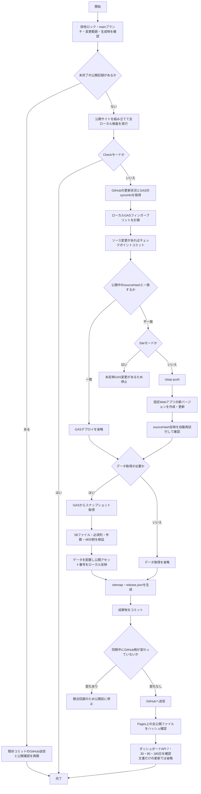

# 日常保守マニュアル

日々のデータ更新、サイト修正、同期、障害対応の手順です。新しいPCの準備は[PC移行マニュアル](PC_MIGRATION_GUIDE.md)、担当者交代は[継承者マニュアル](SUCCESSOR_GUIDE.md)、集計・画面の保守は[ダッシュボードマニュアル](DASHBOARD_GUIDE.md)を参照してください。

[マニュアルの入口](README.md)では、概要から新PC設定・シート編集・公開・譜例・復旧へ順に進めます。本書は日常更新・同期モード・復旧の正本です。譜例追加の仕様は[譜例トークン](SCORE_EXAMPLE_TOKENS.md)に集約しています。

## 1. 日常の作業

**前提：** 権限・PC設定が完了し、編集する正本と公開してよい範囲が決まっていること。

1. スプレッドシートの用語・訳語など、修正する元データを編集し、保存値・使用箇所・数式・日英の対応を読み直します。列契約は第2章を参照します。
2. プロジェクト直下で下記のGit確認を行い、main・origin・変更内容を確認します。他担当の同期、merge/rebase等の未完了操作がないことも確認します。同期は許可対象の未コミット文書等もまとめてコミットするため、別作業を混在させません。
3. シート更新を反映する場合は`.\sync-data.ps1 -Mode Data`を実行します。これは必要なGAS更新、commit、push、Pages公開確認までを含む本番操作です。サイト修正だけの場合は第2章のモードを選びます。
4. 「同期完了」、対象コミットのPages成功、公開ファイル一致、必要なAPI検査の成功を確認します。管理者モードの日英画面で修正箇所・通常検索・辞書実例を確認します。push成功だけでは公開完了ではありません。

```powershell
git rev-parse --show-toplevel
git branch --show-current
git remote -v
git status --short
git diff --stat
git diff --cached --stat
```

**成功の目印：** 元データと公開結果が一致し、必要な自動検査が完了。**次：** 通常運用へ。失敗したら第2章のトラブルシューティング、譜例を追加する場合は[譜例トークン](SCORE_EXAMPLE_TOKENS.md)へ進みます。

管理者自身の閲覧を計測から除外する設定は第5章にまとめています。

ダッシュボードAPIの認証移行では、専用 `DASHBOARD_API_TOKEN` の非公開設定とSitesプロキシの先行公開が一度だけ必要です。GASだけを先に公開しないでください。[ダッシュボードマニュアル](DASHBOARD_GUIDE.md)の初回移行手順を参照してください。`-Mode Check` はこの本番移行や公開を行いません。

### 公開リクエストの保存と受付上限

検索履歴・未登録語観測と、その語を移す判定・候補・語形対応の書込みは、先頭の空白等に続く `=`、`+`、`-`、`@` を文字列として保存します。検索語自体や検索結果の表示を変更せず、既存行の一括変換もしません。

検索通知と未登録語観測は、それぞれサイト全体で毎分30件・日本時間の日付ごとに3000件までです。通知メールは全体で毎分10件・同日80件までとし、GASのメール送信残枠が10件以下ならメールだけを止め、履歴の保存は継続します。受付上限に達した通知・観測は `recorded:false, limited:true` で返し、検索結果の表示は継続します。受付できなかった分を後から再送・補完しません。

カウンターはスクリプトプロパティの `public_request_budget_v1_notification`、`public_request_budget_v1_observation`、`public_request_budget_v1_mail` に件数と時間区分だけを保存し、同じスクリプトロック内で更新します。キャッシュ消失やUser-Agent・イベントIDの変更では上限をリセットできません。カウンターを読めない・保存できない場合は、上限なしの書込みに切り替えず停止します。予約後の失敗も受付数に含めます。手動でのカウンター削除は通常運用では不要です。

同じ検索内容の5秒以内の重複判定ではUser-Agentを識別に使いません。異なる検索や日英の検索は別内容として扱います。同じ内容を複数端末から同時に送った場合は通知・履歴がまとめられる場合があります。これらはシート書込み・メール送信の上限であり、GASへのHTTP呼出し自体や実行枠の消費を完全に防ぐ仕組みではありません。

## 2. データ同期ワークフロー

スプレッドシートから最新データを反映したり、プログラムを更新した場合は、同期スクリプトを使用します。

### 2-1. 同期スクリプトの実行方法
PowerShellから目的に合うモードで実行します。`02_RUN_SYNC.bat`はAutoを呼ぶ入口であり、シートの編集を必ず取得する専用入口ではありません。
```powershell
# シート更新を取得して公開（自動コミット・push・必要なGAS更新を含む）
.\sync-data.ps1 -Mode Data

# ローカル変更から自動選択する通常実行
.\sync-data.ps1

# シート更新に任意のコミットメッセージを指定
.\sync-data.ps1 -Mode Data -message "用語と訳語の更新"
```

### 2-2. 実行される処理の流れ

選択したモードの一回実行で最後まで自動で進みます。シート更新を含む場合はData、ローカル変更からの自動選択はAutoです。ブラウザーでの手動確認操作は不要で、ターミナル上に詳細な進捗がカラー表示されます。

分岐を含むフローチャートは本書の付録を参照してください。

1. main・未完了Git操作・変更パス・生成物の手動変更を確認します。自動マージ、自動退避、生成物の自動破棄は行いません。
2. ブラウザー用コードを組み立て、楽譜情報を自動コピーし、JS/CSSの内容ハッシュを各画面に付けます。既存テストと同期の安全性テストを実行します。
3. GitHub認証と公開設定、GAS編集版HEADと同期元の整合を確認し、ソース変更があればローカルにコミットします。リモートに未取得の変更やHEADだけの未統合ファイルがある場合は、コミット・本番変更前に停止します。
4. GASコードの更新が必要な場合、固定デプロイを更新し、埋め込まれたソースハッシュを確認します。同じコードであればGASの版を追加しません。
5. GASから生成結果を受け取り、実行ID、ソースハッシュ、必須ファイル・列、件数減少、全48実例ファイルと元データの対応を検証します。GASはGitHubへ書き込みません。GitHub認証をGASに送る処理もありません。
6. 全検証に成功してからローカルの生成物を更新し、sitemapと公開ファイルのハッシュ一覧を作成します。
7. 成果物をコミットし、GitHubへ送信します。
8. GitHubへの送信後、最終コミットのPages成功、公開HTML/JS/CSS/JSONの内容一致、ダッシュボードAPI（7/30/90/180日）を確認して完了します。

#### 更新範囲と確認用モード

| コマンド | 動作 |
| --- | --- |
| `.\sync-data.ps1` | 自動選択。変更なしならシートデータ更新。サイトだけの変更では不要なGAS更新・データ生成を省略 |
| `.\sync-data.ps1 -Mode All` | GASの内容を確認し、データも更新。変更のないGASの版は増やさない |
| `.\sync-data.ps1 -Mode Data` | データ更新。必要なGASコード更新も自動実施 |
| `.\sync-data.ps1 -Mode Site` | サイト更新。GASに未反映の変更がある場合は停止 |
| `.\sync-data.ps1 -Mode Check` | ローカルの組み立て・検証のみ。本番変更なし |
| `.\sync-data.ps1 -Mode Verify` | 未完了の公開・確認を再開。既存コミットのpushを含み得る。新しい版やコミット・データ取得は行わない |
| `node scripts/preview-site.js --open` | 現在のローカルデータで目視確認のみ。公開ボタンなし |

**Autoの判定とシート更新：** `sync-data.ps1`は`scripts/sync/main.js`の`plan()`へモードを渡します。Data/Allはデータ取得を指定します。AutoはGAS差分あり、対象ローカル差分なし、または`src/`・`scripts/english-site.js`・`scripts/gm-original-validation.js`・`frontend/notation-contexts.js`に差分がある場合に取得します。シートの変更履歴を調べる判定ではありません。例えばREADMEだけのローカル変更とシート編集が同時にある場合、GAS差分がなければAutoは取得を省略します。**シート更新を確実に反映する目的ではDataを選んでください。** 中断した公開の再開記録がある場合はまず既存公開の確認へ進むことがあるため、完了後に今回のデータ取得が行われたかも確認します。

空データまたは前回データより30%を超える件数減少は停止します。意図した削除だけ `-AllowDataRemoval` を付けます。必須シートや必須列の欠落はこの指定でも許可しません。

#### シートの列の読み取り方（列の移動・入替え）

sync-dataはスプレッドシートの各タブを1行目の見出し名で読みます。下表のタブでは、列を移動・入替えしても生成結果は変わりません。出力JSONの項目順も固定のため、列の並べ替えだけで公開データの差分は生じません。定義は `src/export_json.js` の `EXPORT_SHEET_HEADERS` です。

| タブ | sync-dataが使う見出し（完全一致） |
| --- | --- |
| GM | `de` `de_normalized` `ja` `data` |
| RS / RW | `Oper` `Aufzug` `Szene` `page` `whom` `de` `de_normalized` `ja` |
| Notes | `de` `ja` `source` |
| 語形対応 | `見出し` `関連語形` `語形区分` `用語検索` `実例検索` `補足` |
| RS幕構成 / RW幕構成 | `Oper` `Aufzug` `Szene` `日本語`（`作品名` など見出しのある他の列も後ろに続けて書き出します） |
| 楽譜情報 | `Oper` `Publisher` |

- 見出しの前後の空白は無視します。大文字・小文字は区別します。
- 上表の見出しを変更・削除した場合、または同じ見出しが2列ある場合は、公開前に「必須列が不足しています」「列名が重複しています」で停止します。見出し名は変えずに列だけを動かしてください。
- 上表にない列（作業用の列など）の追加・移動は、幕構成を除き生成結果に影響しません。幕構成では見出しのある列はすべて公開JSONへ出力されるため、作業用の列を置かないでください。
- 略記一覧は見出し行がない（1行目が空行）ため、従来どおりA〜C列の位置で読みます。略記一覧の列は移動しないでください。
- Notes・GM・RW・RSの公開読取り、Notesの出典更新・辞書登録、ダッシュボードの訳語は見出し名で読み書きします。英訳作業専用コードの廃止と列移行の経緯は[履歴資料](ENGLISH_WORKFLOW_RETIREMENT.md)です。日常更新で旧メニュー・列移行を再実行しません。現在の公開版との一致は同期の実HEAD照合で確認します。
- 移行後の本文は `ja`、英語本文は `en`、旧日本語は `ja_old` です。英訳作業専用コードはローカルで廃止済みです。日本語公開JSONへ `en`・`whom_en`・`ja_old` を混入させず、英語は認証付きスナップショットから別生成します。公開ゲートと検証状況は [日英統合同期](BILINGUAL_SYNC.md) を参照してください。
- 列を動かす場合は見出しとデータ・メモ・数式を含む列全体を移動します。API送信中や保存結果未確認の処理がないことを状態メニューで確認し、他の書込み担当と調整してください。Apps Scriptのロックは人の編集や別APIの書込みを排他できません。

`.sync-state/` はこのPC専用の再開記録です。認証トークンを保存しません。公開待ち・検証失敗で停止した場合、同じコマンドを再実行してください。未完了の公開コミットから安全に確認・公開処理を再開します。

#### GAS編集版HEADの安全確認

公開APIの `sourceHash` だけでは、Apps Scriptエディターに追加された未公開コードを検出できません。`scripts/sync/gas-head.js` は、既存のclasp認証を用い、編集版HEAD・固定公開版のコード・`clasp status --json` が示す実際の送信対象を読み取って比較します。`.claspignore` で除外しても、既存のHEADファイルが全量pushから保護されるわけではありません。

- HEADに存在し同期元にないファイル、公開版から変更され同期元に未統合のHEADコード、HEADで削除されたファイルの復活を検出すると停止します。認証・接続・形式の確認に失敗した場合も停止します。
- `sync_build.js` は例外的な生成物です。ローカル値が実ソースから再計算したハッシュと完全一致し、HEAD・公開版も生成コメントとハッシュ定数だけの形式である場合に限り、古い生成値を更新できます。追加コード、形式違い、古いローカル生成値には適用せず、送信直前と送信後はこのファイルも全体照合します。
- ソースのcommit前、GAS送信直前、成果物のcommit前、GitHub push前に照合します。`Verify` や中断後の再開でもpush前の確認を省略しません。GAS送信後は全ファイルを読み戻し、一致するまで公開デプロイを更新しません。
- `Check` はローカル検証だけで、実HEAD照合を行いません。Check成功と通常同期の実行可否は別です。`Auto`・`Data`・`All`・`Site`・`Verify` では、GAS更新が不要な場合も未統合HEADを確認します。
- 停止時は列挙されたファイルを担当者と照合し、必要なコードを同期元へ統合します。旧機能の廃止はトリガーや画面の参照を調査して別途扱います。無検証コピー、claspによる直接の全量push、除外設定の変更で回避しないでください。`-AllowDataRemoval` はGASコードの削除許可にはなりません。

同期のローカルロックは他端末やApps Scriptエディターの書込みを排他できません。直前照合と読戻しの間の競合を完全に防ぐ仕組みではないため、GAS更新中はコードを書き込む担当を一つにします。ソース照合が失敗したときは自動再送しません。

旧英訳コードの統合・廃止経緯は[英語版ロードマップ](ENGLISH_EDITION_ROADMAP.md)と[旧英訳確認ガイド](ENGLISH_TRANSLATION_REVIEW_GUIDE.md)に保存しています。これらの旧メニュー操作は通常手順ではありません。現行の日英生成契約は[日英統合同期](BILINGUAL_SYNC.md)を参照してください。公開リポジトリには汎用コード・模擬テストのみを置き、非公開候補や実シートの取得データは含めません。Pagesの除外設定だけではGitHubリポジトリを非公開にはできません。

GASへの接続確認と更新直後の反映確認は、Google側の一時的な404や通信失敗を考慮して自動再試行します。更新後は約37秒の待機範囲で反映確認を繰り返します。期限内に確認できなかった場合も、同じコマンドを再実行すれば、すでに反映されたデプロイを検出して版を増やさず再開します。

同じ入力から作るHTMLには実行日時を埋め込まず、毎回同じ内容になるようにします。ローカル検査はデータ出力を2回生成して一致を確認するため、時刻など実行ごとに変わる値を生成物へ追加しないでください。

#### 編集元と実装の分担

サイドバーメニュー（`<nav class="sidebar">`）の項目変更は、ルート`index.html`と`mahler-search-app/`の公開HTMLを確認します。辞書`dic.html`は直接編集せず、`src/generate_dic_html.js`のサイドバー生成を変更します。変更後の各画面・辞書は`node scripts/preview-site.js --open`で確認します。

| 対象 | 編集元 |
| --- | --- |
| ブラウザーの検索・表示・読み込み・通知 | `frontend/` の各ファイル。`bundle.json` が結合順序 |
| ブラウザーの文字正規化・一致判定 | `frontend/search-core.js` |
| 楽譜メタデータ | `frontend/score-metadata.js`。公開版へのコピーは自動 |
| 辞書HTML | `src/generate_dic_html.js` とシート。公開dic.htmlは直接編集しない |
| 同期 | `scripts/sync/`。PowerShellは入口のみ |
| 公開前確認 | `scripts/preview-site.js` |

`mahler-search-app/js/app.js`、`mahler-search-app/js/score_metadata.js`、`src/sync_build.js` は組み立て結果です。公開アセットの内容ハッシュはローカルで各HTMLへ反映し、GASの変更判定には含めません。利用者向け画面はGitHub Pages版だけを正本とします。GASは同期スナップショット、検索通知、ダッシュボード集計APIを提供し、GAS URLへ通常アクセスした場合はGitHub Pages版へ移動します。GAS側に利用者向けHTMLテンプレートは置かず、Google Sites等へ画面として埋め込みません。

ブラウザー用データは必要なファイルを並行取得し、同時に同じデータを要求しても通信を共有します。同期時のJSONは、検索・実例などの大量データは1行1レコード形式、設定・定義・マニフェスト等のオブジェクトデータは2スペースインデント形式で整形して保存します（エディタでの可読性向上とGit差分の局所化のため）。既存の実例検索の分割方式・検索結果は維持します。

#### 日常保守メニューの使い方を見る

`🛠 日常保守` → `それぞれの関数の役割を見る` で「日常保守の使い方」を開きます。新規Notes登録の手順と，各メニューの役割・実際のボタン名・API利用と保存のタイミングを確認できます。説明を開くだけではシートデータの取得・変更・API生成を行いません。管理台帳への移行は実施済みのため，通常の登録では使いません。GAS反映後，現在の作業を終えてからシートを開き直すと新しいメニュー項目が表示されます。

#### 追加行の空欄を補完する（日常保守）

GAS反映後にシートを再読み込みすると表示されるメニューです。旧英訳機能・自動翻訳トリガーは使用しません。

メニューは共通ですが、GMは演奏指示と `data`、RW/RSはそれぞれの作品・場面・指示対象、Notesは辞書本文・項目固有の注記・AV/TrVの目録説明として、専用の処理へ振り分けます。Notesを短い訳語の汎用処理で埋めません。APIはこの会話やシート全体を自動では知りません。タブ別の明示ルールと、現行の `ja`・`en` から読み取る安全な採用例を最大2件だけ渡します。`ja_old`・旧修正案は例にしません。

採用例は `maintenance_text_style.js` の限定した見出し・原文から選びます。GM/RW/RSは先頭200行内、Notesは先頭2000行内が読取り上限です。GMは指揮者への注意と記号説明、RWはFarzana/Zemina等の舞台指示、RSは `drohend`・`gut ausgehalten`、Notesは一般義と音楽用例を含む `Bogen`、`allgemein` 等です。AV/TrV用にはAVの採用済み説明の最初の段落だけを使います。例は書式・括弧・文末・訳の粒度のためだけで、内容・人物・出典を新項目へ流用しないよう明示します。連絡先やURLのある例、長すぎる例、古い定型前置きのある例は送らず、安全な現行例が見つからなければ課金前に停止します。

`ja`・`en`がともに空欄の新規Notes辞書項目では、`row_completion_notes.js` が `source` の `[GM]`・`[RW: Oper]`・`[RS: Oper]` に対応するタブから、同じ語・単純な複数形・ハイフン結合を含む採用済み日英実例を探します。各タブ先頭6000行を上限に、短い指示と長い使用文脈を各1件、合計6件・6500文字以内で渡します。`Saite` と `Seite` のような曖昧一致はしません。入力済みja/enだけを内容根拠に使い、旧訳・修正案・空欄訳は使いません。実例は「様式だけの見本」と分けて渡し、原資料そのものは取得しません。音楽実例がある場合は両言語の音楽用語の訳例欄も検査します。上限で未走査の範囲がある場合は `usage_scan.truncated` に残します。

新規辞書項目では、英伊対応が既存本文にないという理由だけで禁止しません。APIは対応語と日本語の根拠説明、利用した実例IDを `notes_support` に返します。入力実例で支持される意味と、モデルの語彙知識による未検証の対応語案を区別し、確認画面で本人だけに表示します。架空の実例ID、新規リンク、不正な対応語列挙は受け付けません。提案を採用するまで要確認扱いとし、不明な言語だけ保留できます。対応語の実在・語義を自動検証する辞書APIではありません。明示的な反映時には対応語も訂正でき、日英のItalian欄が一致することを検査します。既存本文の英訳・注記・AV/TrV・GM/RW/RSには、この新規対応語提案の例外を適用しません。保存済みの前回草案は自動再生成せず、更新後の案が必要なら前回作業を確認して終了し、対象行を読み直して生成します。

Notesの共通様式は次のとおりです。新しい行補完と、既存の「未登録語候補→Notes」の手入力・OpenAI草案・登録の双方で共通の整形・検査を使います。既存Notes本文を一括修正する処理ではありません。

- 日本語の対応列挙は `【英】…／【伊】…` から開始し、「対応する表現：」は付けません。列挙はASCIIの `, ` で区切ります。英伊対応は独立して任意で、不明な対応を様式のために追加しません。既存本文の英訳では入力に明示された対応を使い、新規辞書項目の対応語案は根拠説明とともに別途確認します。
- 英語本文に英語対応だけの列挙は作りません。イタリア語対応があれば先頭を `Italian:` の独立行とし、その下を意味ごとに `イタリア語候補 — 英語の意味` と改行します。同義の候補は `, ` で区切ります。意味の対応・注記は入力を根拠とし、不明な対応を推測して補いません。`Corresponding expressions:` は不要です。
- 英語の音楽用例の見出しは `【Examples in musical contexts】` とし、出典別の各用例に `German: 原文` と `English: 英訳` を付け、例ごとに空行を置きます。原文・訳・出典や必要な奏法説明を形式のために作り替えません。静的用語集・動的な検索結果・辞書表示は共通処理で独英ラベルとItalianの意味別行を区別します。新形式では各用例の先頭に独英ラベルを付けます。同じ段落内のラベルのない行は、その原文・英訳の続きとして改行のまま保存します。空行・出典見出し・節見出しで段落を区切り、次の用例を `German:`／`English:` で始めます。境界後のラベル欠落、出典をまたぐ未完了ペア、孤立した訳、空白だけのItalian語義は受け付けません。同じ段落に紛れた別用例と複数行の英訳は文字列だけでは区別できないため、言語を推測して拒否しません。全用例の機械的な識別が必要なら、将来は原文・英訳を別フィールドに持つ構造化データが必要です。必要な奏法説明は `【Usage notes】` に保持します。複数行の原文・英訳と引用中の改行は保持します。引用内の空行も段落の区切りとしては解釈しません。引用文・コード中の行頭ラベルは書式として解釈せず、原文のまま保持します。
- 既存の単一行 `Italian: …` と旧見出し `【Musical translation examples】` は引き続き検証・表示できます。保存済み草案・シート・JSONを新形式へ一括変換せず、曖昧な既存用例へ独英ラベルを推測で付けません。新形式の `English:` は音楽用例内の `German:` に対応する訳に限ります。出典見出しの正規化も新旧見出しの双方で、確認済み実例と出典に基づいて行います。
- AV/TrVには対応表現欄を作りません。項目固有の説明を保持し、一般的な断り書き・ボタン用文言・不要な参考説明は加えません。
- 日本語の本文は「，」「．」を使います。引用した外国語、URL、コード、HTML、譜例トークンは機械変換しません。固有名詞はRS・Hindemith・Bruckner・Karg-Elert等の現行原語表記とし、日本語との間に半角スペースを置きます。曲名は入力のOthers採用表記を保持し、未提示の作品名・plate番号・頁・リンクを生成しません。

構造・句読点・前置き・未知の英伊対応・保護トークン等に違反する応答は本文へ反映しません。必要な文字列の構造・容量を確認できた案は「案の編集が必要」として本人の記録に残し、APIを再実行せず編集できます。通信・応答構造が不明なら「結果要確認」として自動再送を止めます。GM/RW/RSにはNotes用の辞書見出しや短い指示句への冗長な説明を追加しません。英文末は現行例に句と文の両方があるため、一律に句点有無を強制しません。自動検査だけで訳意・根拠の正しさを保証するものではなく、最終確認は本人が行います。

1. `GM`・`RW`・`RS` に行を追加し、ドイツ語原文 `de` と出典・使用箇所を入力します。GMの `data`、RW/RSの `Oper`・`Aufzug`・`Szene`・`page`・`whom` は原則として本人が入力します。頁の `0` は有効です。原文・使用箇所・出典は生成しません。新規Notesは手入力せず、後述の未登録語からの登録メニューを使います。Notesの選択行補完は既存項目の空欄に限ります。
2. 本文を1～5行選び、`🛠 日常保守` → `項目の作成・補完（Notes・GM・RW・RS）` を開き，`選択行を補完・再開（GM・RW・RS・Notes）` を押します。両言語が空欄なら1～2行ずつを目安にし、補完項目数や文量が上限を超える場合は選択行を減らします。読込み時点ではAPI送信も本文書込みも行いません。補完対象は、値が空文字で数式のない `ja`・`en` だけです。空白だけの文字列も既存入力として保持します。
3. `この行の翻訳案を生成` を押すと、その1行の原文、入力済み訳、出典・使用箇所をOpenAI APIへ送ります。ユーザー方針により毎回の課金確認は挟みません。自動実行・自動再送はしません。GASの既存 `OPENAI_API_KEY` と `OPENAI_DRAFT_MODEL` を使用し、画面へ返す設定情報は「利用準備あり／未設定」の真偽値だけです。新しい認証設定の作成・保存は別途行います。
4. 生成案を確認・編集して `確認した内容を空欄へ反映` を押します。`en` は既存の日本語本文があればその全体の英訳を提案します。Notesの出典が空欄・不明なら生成せず保留します。出典資料の本文は自動取得しないので、資料に固有の意味や引用は本人が確認してください。譜例トークン、URL、引用記号、HTMLタグの欠落・追加・変更は反映前に拒否します。
5. RW/RSの `whom_en` は、「指示対象英訳確認」の4行目の見出しを確認し、同じ区分・作品コード・原語に一致する1件について、「ユーザー判断」が「承認」、選択案または自由修正が入力済みの場合だけコピーします。生成APIの要求項目には含めません。未登録・保留・重複・列構成不一致は「新しい英訳の確認が必要」と表示し、空欄を保持します。確認タブで訳を選択・承認してから対象行を読み直します。別作品・別タブの承認を流用せず、反映直前と書込み時にも承認を再確認します。本文が入力済みで承認済み指示対象訳だけ不足する行はAPIなしで処理できます。

新規Notesの音楽用例を出典別に分ける独立見出しは `[GM]`・`[RW: Oper]`・`[RS: Oper]` に揃えます。出典欄と選択された採用実例の両方で確認できる区分だけを生成時に整形し，同じ条件の見出しは編集後の検証でも認めます。検証用の比較時だけ見出し表記を正規化し，承認した本文はそのまま保存します。本文中の参照記号、詳細な出典、譜例、URL、引用、HTMLの保護は変えません。重複見出し，本文中の追加記号，未確認区分は許可しません。保存済みの案や既存本文は読み直しで自動整形せず，内容確認と承認を維持します。

今後のNotes草案の「音楽用語としての訳例」では、原文使用例とその訳だけで伝わる箇所はその対だけを示し、続く用例の内容を先取り・言い換える説明的な導入文は付けません。日本語・英語とも同じ方針です。ただし、個別の用例だけでは伝わらない奏法上の意味・条件など、入力に根拠のある必要な情報は保持し、説明を一律に削りません。提示された採用実例の原文を保ち、文脈に忠実な訳を対応させます。原文・使用例・出典・使用箇所や根拠を作り足しません。共通のNotes草案生成に適用する指示であり、既存本文や保存済みの案を自動で書き換える処理ではありません。内容と根拠の適否は最終確認時に確認します。

Notes登録画面では、本文の入力が止まった後に、表示中の日英本文を保存せず検証します。これは生成APIを使わず、作業記録や承認状態も変更しません。編集するたびに前の検証結果と確認チェックを無効にし、現在の本文の検証が成功するまで登録を止めます。遅れて届いた別の本文・語の検証結果は採用しません。警告は現在の入力に対応し、登録時には参照記号・出典・重複・対象行の管理状態を再確認します。読取りや検証に失敗した場合も入力を保持し、自動で生成・保存をやり直しません。

GM・RW・RSの必要な理由・確認事項は、生成案の確認後に、同名の `理由・要確認事項` 列が空欄で編集可能な場合だけ `【根拠・未解決点】` の形式で記録します。既存記録・数式は変更せず、列がない場合も勝手に増設せず画面に表示します。不要な理由は書きません。旧検証履歴をAPIへ送ったり、今回見ていない楽譜を実見済みと記したりしません。

`de_normalized` は現行のARRAYFORMULAへ任せます。原文、出典、使用箇所、`ja_old`、旧修正案・承認・履歴列、書式、入力規則は変更しません。数式・配列数式の管理列、結合セル、編集できないセルへは書き込みません。隣行の式・書式・規則を一括コピーする機能ではありません。

選択行補完の生成案と処理結果は、共有シートを増やさず、実行者本人の `User Properties` に前回1件だけ保存します。未登録語のNotes登録も同じ保存方式を使い，内容承認前の案はNotesへ書き込みません。共有の `Script Properties` には重複防止のハッシュと処理ID、Notes新規入力検知用の見出しハッシュと分類、並べ替えの進行状態を保存します。原文・訳文・秘密値は保存しません。公開APIと同期の出力対象は増やしません。保存にはチェックサム付きの2世代を使い、1項目9 KB・ストア500 KBの制限内へ分割します（[Propertiesの利用者範囲](https://developers.google.com/apps-script/guides/properties)、[容量制限](https://developers.google.com/apps-script/guides/services/quotas)）。

中断・通信エラー時は、共通の `項目の作成・補完（Notes・GM・RW・RS）` を開きます。選択行補完は `選択行を補完・再開（GM・RW・RS・Notes）`，Notes登録は同じ処理語の `保存状態を確認` から再開します。これはAPIを送信しません。書込み前に確認済みの案を保存するため、一部のセルだけ反映された場合も、結果を照合して残りの空欄への反映を再開できます。原文・出典・列・対象セルが変わった場合は反映を停止し、人の編集を保持します。ロックはほかのGAS処理との競合を抑えますが、利用者による同時編集を原子的に排他するものではありません。

結果不明の行はAPI利用状況と対象セルを確認するまで再生成しません。実行中扱いの記録を終了する場合は7分以上待ちます。終了の確認欄を選んで `この作業を終了する` を押すと次の作業へ進めます。未反映案が不要な場合もこの操作で終了できます。終了後に新しい選択行を読むと前回記録が置き換わるので、必要な案は先に反映するか本人の手元へ控えてください。

選択行補完は空欄だけが対象です。入力済みの本文を修正するときは，対象タブの `ja`・`en` 等のセルを直接編集します。ダイアログ内で編集できるのは生成した補完案であり，入力済みのシート本文を上書きする操作ではありません。生成案は `確認した内容を空欄へ反映` を押すまで `ja`・`en` へ書き込みません。既存Notesの通常編集と新規Notesの登録前確認は，[後述の手順](#notes-editing-publication)で区別します。確認・反映後もサイト公開は別工程で、シート更新を反映するには `sync-data.ps1 -Mode Data` を使います。Jevの見出し語判定・辞書候補画面は別機能で、そちらの課金確認・採用操作は変更しません。

#### Notesの新規手入力の警告

GAS反映後は、新規入力を始める前にシートを一度再読み込みします。`onOpen` が既存見出しの比較基準を初期化し、以後の `onEdit` がNotesの新しい見出しの手入力・複数行貼付を検知して通知します。入力の消去・差戻し・セル保護は行いません。通常の既存行の本文編集、既存見出しの修正、複数列の貼付、行移動・並べ替え、正規登録メニューからの追加は新規手入力として警告しません。見出しを一度空欄にしても、本文・旧日本語または既存の管理IDが残っている間は同じ項目として扱い、見出しの再入力を新規追加と誤認しません。内容と管理IDをすべて消した後の新しい見出し入力は新規追加として警告します。単純トリガーと既存のインストール型トリガーが重複して起動しても同じ編集の通知を繰り返しません。新しいインストール型トリガーは不要です。

これは入力補助です。比較記録が未準備・破損・読取不可のときは、新規と断定せず、既存編集への警告や既存行補完の制限を出しません。既知の新規手入力行を既存行補完で新規登録の代わりに扱うことはせず、正規の登録メニューを案内します。初期化前、権限・プロパティ容量・実行時間の制限、短時間の大量編集や識別不能な構造変更等では通知できない場合があります。比較は2500行までで、見出し・本文・既存管理IDの短縮ハッシュと状態だけを保持し、本文や管理IDそのものは比較記録へ保存しません。旧形式の比較記録と手入力済みの状態を保持して更新します。Googleの `onEdit` は同時に保持するイベント数に上限があるため、完全な禁止機構ではありません。この警告でセルの編集や同期対象を制限しません．シートにある現在値は次回同期の入力になります（[トリガーの制約](https://developers.google.com/apps-script/guides/triggers)）。GM/RW/RSの翻訳は編集時の自動実行にはせず、明示したメニュー操作で行います。

#### GM・Notesの並べ替え

🛠 日常保守 → 並べ替え は，GMとNotesの2行目以降をA列の昇順（A→Z）に並べ替えます．標準のRange.sortを使い，全列のデータ・管理ID・公開状態・セルメモを同じ項目と一緒に移します．並べ替え後，Notesの見出しがある行の「準備状態」（現在I列）を「承認」にします．空の見出し行は変更せず，新規下書き・登録途中の公開管理状態も変更しません．他タブの走査，固定URLの追従，履歴原文の変更，作業用タブ作成，Sheets API呼出しは行いません．追加のCloud設定・権限スコープは不要です．

GM!B2の既知の正規化ARRAYFORMULAは，派生B列を一時解除して並べ替え，同じB2へ復元します．並べ替えが失敗しても復元を試みます．見出し行は動かさず，COUNTA・COUNTIF・見出し間の比率の式を同じセルへ戻します．各タブの処理後に本文・セルメモの件数と内容，配列式と見出し式を照合します．他の本文数式，保護・結合セルは実行前に停止します．未終了の草案や生成予約があるだけでは並べ替えを止めず，それらの保存状態・予約を保持します．並べ替え後の登録・補完では，原文・出典・本文・列構成の一致する対象を再照合し，変更や曖昧な一致があれば書込みを停止します．

GM，Notesの順に処理するため，両タブ一括の原子性はありません．途中で失敗した場合は完了タブと処理状態を記録し，自動で再実行しません．行高などの行寸法は標準の範囲並べ替えの動作に従います．公開サイトの同期・API生成は行いません．

#### 辞書候補ワークフロー

検索語の観測を入口に，通常は統合した `🛠 日常保守` メニューを使います．新規Notesは出典・日英案を準備し，内容を確認してから登録します．語形対応も人が確認してから反映します．保守管理台帳は未登録語の観測・Jev判定・候補と履歴の現役保存先なので維持します．Notes・GM・RW・RSの現在値が同期の正本であり，公開管理記録や旧公開許可一覧は使いません．シートの更新をサイトへ反映する工程は `sync-data.ps1 -Mode Data` です．

`Notes` の見出しは，明示的に統合した項目を除き，元の見出しを保持します．例えば `Abstufungen` を `Abstufung` に置き換えず，`語形対応` のA列を `Abstufungen`，B列を関連語形 `Abstufung` とします．B列の語を用語検索したときはA列の見出しへ移動し，「実例を見る」では両方の語形を検索対象に含めます．関連語形にも独立見出しがある場合は，その独立見出しを優先します．

`Notes` は見出し名 `de`・`ja`・`en`・`source`・`ja_old` で参照します．現在の配置はA列見出し、B列日本語本文、C列英語本文、D列出典、E列旧日本語です．後続データも行と一緒に保持します．草案画面の本文はNotesの `ja`、出典は `source` の見出し名で保存先を解決します．出典を英語本文のC列へ書くことはありません．`語形対応` のA～F列は `見出し`，`関連語形`，`語形区分`，`用語検索`，`実例検索`，`補足` です．`sync-data` は `Notes` と `語形対応` を読みます．

GM・RW・RSの「用語から検索」には，辞書の「実例を見る」から移動した場合，実際に追加検索する登録語形・別綴りを具体的に列挙します．例えば `stürzt` に `stürzen` が登録されている場合は，「stürzen」も見出し「stürzt」に登録された語形変化として検索対象であることを表示します．検索欄を編集したときはこの案内を隠し，通常検索に戻します．検索欄から直接検索した場合は，関連語形の案内を表示せず，入力語に一致する実例だけを検索します．対応表にない語形は自動推定しません．

| タブ | 役割 | 通常検索から自動更新するか |
| --- | --- | --- |
| `検索結果未登録語` | 用語検索で1件以上ヒットしたが，検索語そのものが辞書見出し・登録済み関連語形にない場合の観測先 | 更新する |
| `Jev判定` | Jevの分類助言とM列 `人による確認` による採否 | 更新しない |
| `語形対応` | 人が採用した関連語形と検索範囲 | 更新しない．明示操作で反映する |
| `未登録語候補` | 人が採用した新規用語候補とOpenAI草案 | 更新しない．明示操作で反映する |
| `未解決語観測_正規化テスト` | 0件検索を集めていた旧方式の履歴．将来の再判定・新方式との比較検証に使えるよう列構成を保持する | 通常検索からは更新しない |

公開検索から自動記録するのは候補観測までです．Jevは課金を伴うため，検索のたびに自動実行しません．また，Jevの出力だけで関連語形や新規用語を採用しません．

#### 保守管理台帳の通常運用

観測・Jev判定・旧草案は移行済みの `保守管理台帳` に保存します．`maintenance_ledger.js` は現在の台帳の参照・更新・登録保護を担当します．初回移行のメニュー・計画作成・複製・有効化処理は廃止しました．上表と以下の旧タブ名・列番号は互換層が扱う論理上の構成です．元3タブや控えがなくても，有効な管理台帳だけで通常の登録・判定を行います．台帳やJSONセルは直接編集せず，日常保守の画面を使います．この台帳は公開データの出力対象ではありません．

台帳は種別・元の記録ID・連結ID・保護状態・内容JSON・内容ハッシュ・更新日時で構成します．日時，原語，文脈，候補一覧，人の採否とメモ，草案と生成状態を保持します．更新先は元IDから毎回解決し，物理行を並べ替えても別の記録へ書き込みません．確認後に内容ハッシュが変われば，上書きやAPI再送をせず停止します．未確認・保留・実験草案，移送先との不一致，Jev実行待ち・草案生成中・結果要確認の再送禁止を維持します．実験草案は本番Notesへ登録しません．

Script Properties の `MAINTENANCE_LEDGER_ACTIVE_V1` は現在の保存先を特定する現役の設定です．削除・初期化しないでください．有効化情報に古い移行・控えの情報が含まれていても，通常運用では現在のブック・台帳ID・版を確認します．台帳の欠落，ID・保護状態・内容ハッシュの不整合を検出した場合は，旧タブへ自動で戻ったり移行を再実行したりせず停止します．保存済みの記録と有効化情報を確認して復旧してください．

不要になったファイル・プロパティ・公開版の整理は，現行機能や残っている公開デプロイからの参照を確認して別途実施します．台帳・Notes・語形対応の登録や，シートの値・数式・入力規則をこのコード整理で変更しません．

#### 統合メニューで未登録語をNotesへ追加する

入口は `🛠 日常保守` → `項目の作成・補完（Notes・GM・RW・RS）` に統合しました．独立した選択行補完・前回結果・モデル検査のメニューはありません．GM/RW/RS/Notesの既存行は画面内の `選択行を補完・再開（GM・RW・RS・Notes）` を使い，タブ別の翻訳処理と確認後の空欄反映を維持します．未登録語は同じ画面の「未登録語をNotesへ登録する」で扱います．

1. 観測された検索語を1件選び，`出典を調べて日英案を作る` を押します．RS・RW・GMの原文と使用箇所の調査，重複確認，OpenAI APIによる日英本文案の生成までを一度で続けます．途中の人手操作や追加の課金確認はありません．この段階ではNotesの行・列・本文を書き込みません．出典不明・既存見出し/語形との競合は推測登録せず停止します．旧台帳に保存済み草案があれば，内容を統合画面に読み込み，APIを再送せず英語本文を補って確認できます．旧API結果不明や実験草案は登録へ進めません．
2. 現在処理中の語だけに，日本語本文と英語本文を分けて表示します．「本文を編集する」で修正すると表示も更新されます．「出典・根拠・用例を確認する」にはシート内の原文・採用訳・使用箇所と，APIの語彙知識による未検証の判断を区別して表示します．管理用の説明や根拠欄はNotes本文へ付け足しません．
3. 出典・日英本文・対応語を確認する欄を選び，`内容を承認してNotesに登録` を押します．表示したde/source/ja/enと登録再開用IDを1回の行書込みで保存し，保存値を照合します．このボタンの承認は登録内容の確認を指し，公開管理状態や承認ハッシュは作りません．確認前の案は本人の保存記録だけに保持します．シートへ登録した現在値は次回同期の対象ですが，この画面から同期・サイト更新は行いません．
4. サイトへ反映するときだけ，別途 `sync-data.ps1 -Mode Data` を実行します．Notesの本文・出典はシートで直接編集でき，次回同期はその現在値を使います．編集後の公開承認や許可一覧への追加はありません．新規登録前の内容確認は引き続き必要です．

出典確認は各タブの適格な原文と使用箇所を全行確認し，入力した語・句の基本形を実際の原綴りから探します．語尾付きの行が先にあっても後続の基本形を見落とさず，基本形のある行を根拠に優先します．語の一部分や別語を近似採用せず，基本形がどの適格行にもなければ語形から見出しを推測せず停止します．複数の原綴りが競合する場合も人の確認へ回します．原文・作品・使用箇所を作り足さず，選んだ実在行の内容ハッシュを登録時に再照合します．各タブ6000行の上限，原文長，使用箇所の条件は維持します．

生成案と処理意図は本人のUser Propertiesに保持します．画面を閉じても，処理語を選び `保存状態を確認` でAPIを再送せず確認できます．通信結果不明は自動再送しません．形式違反は日本語/英語ごとの具体的な理由を表示し，同じ画面で案を直して承認できます．登録途中は承認済みの4欄と行予約を保持し，`承認済み内容の登録を再開` で同じ行と保存結果を照合します．未保存なら確認済み4欄をまとめて書込み，保存済みなら重複書込みせず完了します．既存値・数式・列変更・他人の更新を検出した場合は停止します．GASのロックは他のスクリプト更新を排他しますが，利用者の同時編集を完全なトランザクションとして排他するものではありません．

旧方式で既にシートにあるetwas等の行は削除せず，その現在値も同期対象にします．同じ処理ID・管理ID・元データを再照合し，内容確認後に同じ行の既存入力を保持して完成させます．同じ見出しの新行を重ねたり，既存の本文・出典を上書きしたりしません．別の語の処理や未確定の選択行補完が進行中なら，内容を保護して切替を止めます．現在の語を登録または必要な案を控えて終了してから次へ進みます．「本人の前回作業」や全Notes下書きの一覧は表示しません．

<a id="notes-editing-publication"></a>
#### シートの現在値を編集・同期する

Notes・GM・RW・RSのシートの現在値を同期の正本とします．Notesは見出し語 `de` のある行を対象にし，公開管理記録・旧公開許可一覧・承認状態・承認ハッシュでは選別しません．既存Notesの `source` 空欄も含め，すべての既存行へ新規登録用の必須4欄を一律適用して項目を落とすことはありません．日英本文・出典・使用箇所の入力内容を確認してからData同期へ進みます．シート保存とサイト公開は別工程です．

既存Notesの `ja`・`en`・`source` やGM・RW・RSの対象セルは，これまでどおりシートで直接編集できます．編集後の公開承認や項目の削除・登録し直しは不要です．空欄補完は統合画面から確認した案を空欄へ保存する機能で，入力済みの値・数式は上書きしません．

新しいNotesは日常保守メニューで出典と日英本文を確認してから登録します．未確定の案はUser Propertiesに保持し，Notesにはdeだけの下書き行を新しく作りません．確認済み4欄をまとめて保存し，登録時の重複・式・保護・競合と保存結果を検査します．通信結果が不明ならAPIや書込みを自動で繰り返さず，同じ処理の保存済み内容を照合して再開します．

`src/notes_registration.js` の `maintenance_id`・`maintenance_observation_id` は，登録途中の同じ行を識別して二重登録を防ぐためだけに使います．同期・HTML・検索索引・語形対応・ダッシュボードの公開条件ではありません．登録確認時だけ不足するID見出しを末尾へ追加し，読取りや同期では列を追加しません．旧 `publication_state` は作成・参照・更新せず，既存列を一括削除する処理も行いません．

GASの旧公開判定2モジュールの削除は，本番1703で確認した種類・内容ハッシュ・プロジェクトを固定した廃止記録で検査します．これはコード削除対象の確認用で，Notesの公開許可一覧ではありません．対象に未確認の編集があれば通常同期を停止します．

語形対応等の補助データは現在のシート値を使い，対応先見出しの存在や競合を検査します．公開許可一覧による語形の除外はありません．データ削除を伴う同期の `-AllowDataRemoval` は別の明示承認が必要です．

モデルの一度限りの移行・検査は完了したため，専用メニューとAPI検査用モジュールは廃止しました．通常の生成は既存の `OPENAI_API_KEY` と `OPENAI_DRAFT_MODEL` をそのまま使い，設定変更や追加の疎通API検査を行いません．既存の設定値・検査記録・認証情報を削除する処理はありません．

#### 統合メニューで語形対応を確認する

`🛠 日常保守` → `既存見出しへの語形対応を確認` では，検索語，対応するNotesの現在の見出し，語形区分を選び，確認後に語形対応へ追加します．Jevを呼ばない手動確認も可能です．原文実例がない語，別見出しへの既存対応，Notesにない対応先は受け付けません．同じ組合せは重複追加せず，Notesの入力済み本文・出典も書き換えません．Jevが必要なら同画面の `Jevで調査・過去の判定を確認` から既存の判定画面を開きます．Jevの課金確認と，人による採否を維持します．

Jev判定と旧候補の未確認草案は，保守管理台帳を通して確認します．以下の旧タブ名・列番号は論理上の項目を表し，採否の保存にはダイアログを使います．旧台帳・旧草案経路・プロパティ・APIキーの削除は別作業です．現行のOpenAI用 `OPENAI_API_KEY`・`OPENAI_DRAFT_MODEL` とJev用 `TYPESAFE_API_KEY` は統合後も必要です．旧英訳設定の名前やOpenAI側のキー表示名だけで現在のキーとの対応を断定しません．

#### 旧候補草案・Jev台帳を確認する

語形対応画面の `Jevで調査・過去の判定を確認` から旧対話画面を開けます．観測一覧から1件を選択すると，検索語，検索ページ，検索件数，取得できたドイツ語の文脈を確認できます．以下は保存中の旧草案とJev台帳の確認・復旧経路です．新しいNotes追加は上記の連続処理を使います．旧画面からのNotes登録は終了し，保存済み草案の確認・編集と履歴の参照を行います．新規登録は統合画面で日英を確認します．公開検索からダイアログは自動表示されません．

この画面にはApps Scriptの `script.container.ui` スコープを使用します．導入後，最初の実行時にGoogleの再承認画面が出る場合があります．これはスプレッドシート内でダイアログを表示するための権限であり，API課金や本番用Notesへの書込みを許可する操作ではありません．

画面は「観測の確認 → Jev判定 → 人による採否・分類の確認 → その1件だけを移送 → 新規見出しの場合は旧草案の確認」の順に進みます．JevとOpenAI APIによる草案生成はそれぞれ任意で，実行ボタンの後に課金可能性を示す確認画面が出ます．確認を拒否してもAPIは呼び出しません．OpenAIの草案にはスクリプト プロパティの `OPENAI_API_KEY` と `OPENAI_DRAFT_MODEL` を使用します．キーはダイアログやセルに表示しません．通信の成否が不明な場合は候補行を `結果要確認` とし，API利用状況を確認するまで再実行しません．草案はAPIを使わず手動入力することもできます．

人による採否はダイアログから `Jev判定` のM列へ保存します．「採用」を選んだだけでは移送せず，次の確認操作で選択中の1件のみ `語形対応` または `未登録語候補` へ移します．新規見出しでは英語・イタリア語の類語，原形・語形の記述，一般的な意味を本質的に異なる意味ごとに1行ずつ，音楽用語としての訳例を入力・確認します．B列本文は，根拠がある場合だけ【英】…／【伊】…（区切りはASCIIの comma+space）→日本語による語形説明→【一般的な意味】①②…→【音楽用語としての訳例】の順に組み立てます．AV/TrVの目録説明には対応語欄や音楽用語の訳例を強制しません．例えば `Seite は女性名詞の単数主格（die Seite）．単数属格は der Seite，複数主格は die Seiten．` のように記し，`Substantiv，feminin．die Seite，der Seite，die Seiten` のようなドイツ語ラベルと語形の羅列は保存・登録時に拒否します．RS・RW・GMの実例を見出しごとに調査し，該当するものだけを `source` 欄へ `[RS: Oper], [GM], [RW: Oper]` のように半角カンマ区切りで自動設定します．該当する実例を確認できない場合は登録しません．コメントは任意入力のみで，AIの未確認事項や説明は自動挿入しません．旧画面の本文・出典表示は確認用です．`candidateWizardRegisterExperimental` は案内を返して書込みを行いません．新規登録は統合画面に一本化し，旧草案と履歴は削除しません．類語や格変化形，複数形は根拠なく補いません．既存見出しと同じ正規化語形は登録を拒否します．公開サイトには`sync-data.ps1 -Mode Data`を実行するまで反映されません．

旧草案は見出しがあれば途中保存できます．「草案を保存する」が成功すると「5．旧草案の本文を確認する」へ移動します．必要項目の不足も表示しますが，この旧画面からNotesへ登録することはできません．統合画面で同じ未登録語を選ぶと保存済みの日本語草案を読み込み，英語本文・出典・対応語を確認して登録できます．APIは自動で再送しません．英語・イタリア語の対応語は独立して任意で，不明な語を形式のために補いません．

草案作成中は操作ボタンと入力欄を無効にし，進行状況とエラーを草案作成ボタンの近くに表示します．失敗後はAPIを再実行せず，保存状態だけを読み直します．読み直しも失敗した場合は再生成を停止し，「草案の状態を確認」から再確認できます．このボタンは保存済みの草案も読み直すため，未保存の入力があれば先に保存してください．

対話画面の各操作では，操作したボタンの近くに処理中・完了・取消・失敗のメッセージを表示します．次の段階へ進む操作は移動先にも結果と次の手順を表示します．草案保存時に見出しが空欄なら送信前に案内し，保存成功後はNotes登録に必要な不足項目を具体的に示します．失敗時は入力を画面に残し，理由と再確認方法を表示します．通信エラーは保存失敗と断定せず，入力を控えてから保存状態を確認します．完了通知のための追加の確認ダイアログは表示しません．

草案の失敗時は「未登録語候補」のM列に `結果要確認`，N列のJSON内 `_draftFailure` に処理段階，HTTPステータス，既知の停止理由，記録日時を保存します．APIキーやHTTPエラー本文は保存しません．保存段階の失敗では生成済み草案もN列に保持します．過去の記録で失敗理由がない場合は，詳細未記録と表示します．利用履歴と保存済み草案を確認した後，「利用状況を確認して再生成を準備」で確認するとM列を `再生成待ち` に変更します．この操作はAPIを呼び出さず，既存の草案を保持します．続いて「OpenAI APIで草案を作る」を押し，別途課金確認を行った場合だけ再生成します．`生成中` の行やNotes反映済みの行は，この操作で再生成待ちに変更できません．

旧登録の見出しを削除済みで，保存済み候補を復旧する場合に限り，同じ検索語を対話画面で選び，「この候補の編集を再開する」を使います．既存のJev判定と旧草案は残し，APIは自動的に再実行しません．見出しがNotesに残っている場合は再開できません．通常の既存Notes本文の修正にはこの復旧操作を使わず，Notesの対象セルを直接編集します．

1. GM・RS・RWの「用語から検索」で，検索結果が1件以上あり，検索語が辞書見出し・登録済み関連語形にない場合だけ，`検索結果未登録語` へ同一正規化語形ごとに集約します．0件検索では記録しません．管理者モードでは既定で記録せず，5-2節の明示的な候補観測ON時だけ記録します．
2. GASのApps Script画面で，スクリプト プロパティ `TYPESAFE_API_KEY` にJevのAPIキーを設定します．PCの `.env` はGASへ自動転送されません．キーはシートのセルやコードには入力しません．`🛠 日常保守` → `既存見出しへの語形対応を確認` → `Jevで調査・過去の判定を確認` を開き，検索語を1件選んでJev判定を実行します．実例の文脈を取得できた場合に限り，確認画面で「はい」を選ぶと，その1語についてJev APIの呼出しが1回行われ，課金が発生する可能性があります．文脈を取得できなければ，課金前に停止します．通常検索・通常同期からJevは自動実行されません．
3. 成功すると，`Jev判定` に判定が1行追加され，元の観測行は `Jev判定済み` となりJ列に判定IDが入ります．同じ観測の再実行は抑止します．API通信・応答・保存で失敗したときは観測行を `Jev判定待ち` のまま残します．呼出しが課金されたか不明な場合があるため，API利用状況と判定タブを確認するまで再実行しないでください．
4. 人が分類・対応見出し・確信度を確認し，ダイアログで `採用`，`却下`，`保留` を選んで採否を保存します．保守管理台帳のJSONセルを直接編集しません．
5. 対話画面で採用済みの1件だけを移送します．`INFLECTION`，`ORTHOGRAPHIC_VARIANT`，`TYPO` は `語形対応` へ，`NEW_TERM_CANDIDATE` は `未登録語候補` へ移します．一括反映メニューは本番移行時に除きました．
6. `語形対応` ではA列とB列の組合せを重複追加しません．関連語形を追加した時点で，その語形をRS・RW・GMから調査し，対応する見出しのNotesの `source` 列（現在D列）へ `[RS: Oper]`，`[RW: Oper]`，`[GM]` を既存記載と重複しないよう追記します．既存の対応をまとめて再確認する場合は，スプレッドシートの `🛠 日常保守` → `既存語形対応の出典を調査` を実行します．`INFLECTION` は自動処理だけで格変化形・複数形・活用形等を断定せず，C列を `語形変化（要分類）` として人の確認を残します．
7. 新規用語は草案・B列本文・出典を確認してから `Notes` に見出し順で登録します．公開サイトに反映する時点で`sync-data.ps1 -Mode Data`を実行します．

#### 完了した一括調査の整理

`語形対応_一括調査` と `辞書語形・検索対応_仕様` はユーザーの指示により外部の復元用コピーを確認し，2026-11-03に削除しました．一括調査の専用メニュー・確認画面・R列編集トリガーもローカルのGAS同期元から廃止し，通常の `語形対応`，Notes，未登録語観測，任意のJev調査は維持します．コードから旧タブを自動再作成しません．旧名で始まる別の履歴タブは削除対象に含めません．

GAS反映時の削除ガードは `scripts/sync/maintenance-retirement-20261103.json` を使います．基準版1689の `maintenance_model`，`morphology_survey_dialog`，`morphology_survey_review` の3ファイルだけを，固定の名前・種類・内容ハッシュとプロジェクト照合で許可します．従来の英訳廃止承認とは別に検査し，未確認の追加ファイル削除，HEADの独自編集，基準版不一致，部分的な削除は引き続き停止します．マニフェストの変更も事前確認チケットを失効させます．

控えは [一括調査](https://docs.google.com/spreadsheets/d/1HJh_hgiFKoBdLzd2agwLKtN5Jt41p1UtptuC9FEkNGg/edit) と [仕様](https://docs.google.com/spreadsheets/d/1ZpMAfZLW5vZxBjyLaAlyVL-l9_DuePqt4Gutdba5Wbk/edit) です．原本と全セルの値・書式・メモ，グリッド設定，条件付き書式の一致を確認しています．復元時は控えのタブメニューから「コピー先」→元のスプレッドシートを指定し，元のタブ名へ戻します．復元したタブのgidは元と異なるため，旧タブへの直接リンクが必要なら更新します．必要な処理は保存したソースと要件を確認してから再導入し，一括調査やAPIを自動で再実行しません．

この経路はメール通知と本番の検索履歴から独立しています．未登録語観測の短時間重複は `CacheService`，行更新の競合は `LockService` で抑止します．観測にはUser-Agentを保存しません．

### 2-3. 管理者ダッシュボードとの連携

通常のシート更新ではSitesへの再公開は不要です。同期末尾のAPI検査（7・30・90日）と、所有者画面の「最終更新」を確認します。API・画面の修正、Sites公開、復旧は[ダッシュボードマニュアル](DASHBOARD_GUIDE.md)を参照してください。

### 2-4. 復元手順

* 問題発生時は、作業直前に記録したコミットと公開バージョンを基準に差分を確認してください。過去の特定コミットやSitesバージョン番号を恒久的な復元先にはしません。
* コードを戻す場合は、復元対象のコミットから確認用ブランチを作り、必要な差分だけを通常のコミットとして反映します。作業ツリー全体を消す `git reset --hard` は使用しません。
* ダッシュボードの公開を戻す場合は、Sitesの管理画面で所有者が直前の正常なバージョンを選び、内容と所有者限定設定を確認してから公開します。コードの復元とSitesの公開切替は別作業です。
* GASに問題がある場合は、固定Webアプリのデプロイを直前の正常なコードへ戻してAPI検査を行います。Sitesを戻しただけではGAS APIは戻りません。
* 用語データを戻す場合は `dic.html` や `data/` を直接修正せず、スプレッドシートまたはGASの生成元を修正して `sync-data.ps1` を再実行します。
* 固定GAS WebアプリURLを変更しない限り、ダッシュボード側の `GAS_API_URL` は変更しません。

### 2-5. トラブルシューティング

- 生成物の手動変更で停止：作業内容を別のファイルに保存し、生成元に反映してください。sync-dataが自動的に変更を捨てることはありません。
- main以外・未完了のマージで停止：対象ブランチやGit操作を整理してから再実行してください。
- リモートが先行：ローカル変更をコミットしたうえで `git pull --rebase` を行い、差分を確認して再実行します。
- データ検証で停止：シート名・列名・件数を確認します。日英の元行不一致では、検査を無効化せず公開未完了として停止し、日英exportの元値と正規化を照合します。検証に失敗した結果は公開しません。
- 公開確認で停止：Gitへの送信とPages公開は別工程です。通常のsync-dataまたは `-Mode Verify` で最終コミットの確認を再開します。
- ダッシュボードだけ失敗：公開結果と区別して未完了を報告します。再実行ではデータ生成やGASの版作成を繰り返しません。
- GAS反映確認で停止：同じsync-dataを再実行します。反映遅延や一時的な通信失敗は自動再試行され、反映済みなら同じデプロイを再利用します。

### 2-6. 保守記録と秘密情報

公開作業ごとに日付、変更内容、コミットID、公開先、確認結果を `CHANGELOG.md` に記録します。ダッシュボードの記録項目は専用マニュアルを参照してください。

`.env`、APIトークン、Googleアカウント情報、Sitesの認証情報はGitへ保存しません。引き継ぎ時は値そのものではなく、保管場所とアクセス権を安全な別経路で共有します。

---

## 3. 楽譜情報の更新手順

あらすじ集（`rs_synopsis.html`・`rw_synopsis.html`）は作品検索画面と構成をそろえ、DriveのPDFへリンクします。クリックはGA4の離脱クリックとして計測します。日英PDFの正本は`synopsis`タブのA:Cで、列契約・空欄時の扱いは[日英統合同期](BILINGUAL_SYNC.md#synopsis-pdfリンク2026-10-22)を参照してください。

ワーグナーおよびシュトラウスの作品検索画面に表示される「楽譜情報（出版社、プレート番号、IMSLPリンク等）」をコード側で更新する手順です。

1. **`frontend/score-metadata.js`** を開き、該当する曲の情報を編集します。
2. 編集後、通常の同期を実行します。公開側へのコピーは同期処理が自動的に行います：
   ```powershell
   .\sync-data.ps1
   ```
3. 同期の完了後、公開サイトで楽譜情報を確認します。公開前に確認したい場合は、先に `node scripts/preview-site.js --open` で表示を確認します。

---

## 4. サイト運用（SEO・パフォーマンス向上）

### 4-1. SEO（検索エンジン最適化）
* **正規タグの設定**: 各 HTML の `<head>` 内に `<link rel="canonical">` および `<meta property="og:url">` が指定され、重複コンテンツを防いでいます。
* **新規ファイル追加時**: `sitemap.xml` への追加に加え、`scripts/sync/artifacts.js` のサイトマップ更新処理と公開対象一覧を確認します。

#### robots.txt とルート用リポジトリ

`https://yutaka-okawachi.github.io/robots.txt` は、ホストのルートに置く必要があるため、専用リポジトリ [yutaka-okawachi/yutaka-okawachi.github.io](https://github.com/yutaka-okawachi/yutaka-okawachi.github.io) で管理します。現在の役割は、`gaswebapp-manual` のサイトマップURLを検索エンジンへ知らせることだけです。

通常のページ追加・本文修正・デザイン変更・検索データ更新では、ルート用リポジトリを変更しません。本リポジトリ側でページ、内部リンク、`sitemap.xml`、必要に応じて `scripts/sync/artifacts.js` の公開対象一覧 を更新します。公開ページをルート用リポジトリへ移す必要はありません。`sync-data.ps1` はルート用リポジトリを更新しません。

ルート用リポジトリを変更するのは、次の場合に限ります。

* サイトマップの公開URLを変更した場合
* `yutaka-okawachi.github.io` ホスト全体のクロール許可・拒否方針を変更する場合
* ホスト名やGitHub Pagesの構成を変更する場合

変更後は、次の2つを別々に確認します。

1. `https://yutaka-okawachi.github.io/robots.txt` がHTTP 200で取得でき、`Sitemap:` 行が正しいこと
2. `https://yutaka-okawachi.github.io/gaswebapp-manual/sitemap.xml` がHTTP 200で取得でき、掲載URLが正しいこと

Google Search Consoleへ `robots.txt` を登録したり、ルート用リポジトリのために新しいプロパティを追加したりする作業はありません。既存のサイトマップが「成功」なら、そのままで構いません。未登録または「取得できませんでした」の場合だけ、既存プロパティの「サイトマップ」から上記のサイトマップURLを1回送信し、後日ステータスを確認します。通常のページ更新ごとに再送信する必要はありません。

### 4-2. パフォーマンス向上 (PageSpeed Insights 対応)
* **フォントの最適化**: ページ読み込み時の LCP（最大コンテンツ描画）遅延を防ぎ、ページ間の見た目を統一するため、トップページ、6つの検索ページ、2つのあらすじページ、用語集では、ページ冒頭の説明、HOMEの各カード内の説明・一覧と注意書き、利用案内、特殊文字の入力方法を案内する枠に、システムのゴシック体を指定しています。共通化できる説明要素には `.page-description` を使用し、「作品を選択」「楽器を選択」などの操作系見出しも同じゴシック体に統一します。用語集の説明文は `src/generate_dic_html.js` を正本とし、生成物の `mahler-search-app/dic.html` は直接編集しません。検索結果と用語検索入力窓は対象外とし、ドイツ語はLora、日本語訳は明朝体を維持します。
* **Googleタグの遅延読み込み**: 描画ブロックを防ぐため、`gtag.js` を即時ロードせず、ページ読み込み後に遅延して追加する実装を行っています。
* **CSSの扱い**: `common.css` は描画ブロック警告が出ることがありますが、レイアウト維持のためにトップページからも単純に削除しないようにしてください。
* **PCの固定検索バー**: サイドバー、ページ本文、法務フッター、フローティング検索バーの左端には、`common.css` の `--sidebar-width` を共通で使用します。固定検索バーだけに個別の幅を設定すると、サイドバーとの間に隙間または重なりが生じるため避けてください。モバイル幅では従来どおり画面幅いっぱいに表示します。
* **「実例を見る」アコーディオンの事前埋め込み方式**:
  巨大な辞書ページ（`dic.html`、1.2MB以上）において、「実例を見る」をクリックした際に動的にDOM要素を生成して挿入すると、ブラウザが大きなレイアウト再計算（リフロー）を引き起こすほか、翻訳ツールや広告ブロックなどの拡張機能が「DOM変更監視（MutationObserver）」によってページ全体を再スscanしてブラウザをフリーズさせる原因になります。
  そのため、アコーディオンで表示するリンク要素は最初から非表示状態（`display: none;`）でHTML内に埋め込んでおき、クリック時は単に `display` スタイルの変更のみを行うようにして、DOMの追加/削除処理を回避しています。
* **「実例を見る」の実利用時間計測**: 用語集から実例検索へ移動する直前の時刻を同一タブ内に一時保存し、検索結果の描画完了時との差をGA4へ送信します。5分を超えた値や検索語・遷移先が一致しない値は破棄し、古い操作や別ページの値が平均へ混ざらないようにしています。
* **「実例を見る」からの画面復帰・強調表示**: 用語集で各作曲家の実例リンクをクリックした際、親行の用語IDをURLハッシュ（`history.replaceState`）および `sessionStorage` に保持します。検索結果画面からブラウザの「戻る」ボタンで復帰した際（BFCache時の `pageshow` を含む）、該当用語のアコーディオンを展開し、`content-visibility: auto` による再レイアウトを考慮した位置合わせ（`scrollToHashTarget`）で画面最上部に復帰させ、検索結果の青い用語リンク遷移と同様に黄色で約2.5秒間強調表示（`.highlight-active`）します。
* **Googleタグ（gtag）のエラー例外保護**:
  プライバシー保護アドオンや広告ブロッカー等によって `window.gtag` の呼び出しが遮断・阻害されることで、JavaScriptの実行エラー（例外）が発生しアコーディオンの開閉処理自体が止まってしまうのを防ぐため、イベント送信部分は必ず `try...catch` 構文で保護しています。

## 5. 管理者ブラウザの解析・検索記録除外

このマニュアルは，サイト管理者自身の検索や閲覧を，通常利用者の利用状況から除外するための「管理者モード」の設定方法を説明します．

管理者モードを有効にしたブラウザでは，検索機能そのものは通常どおり使用できますが，次の処理を停止します．

- Google Analytics 4（GA4）へのアクセス・検索イベント送信
- 検索時のメール通知
- Google スプレッドシート「検索履歴」への記録

### 5-1. 管理者モードの単位

管理者モードは，端末そのものではなく **ブラウザの保存領域（localStorage）単位** で保存されます．

そのため，次の環境ではそれぞれ一度ずつ設定してください．

- Android スマートフォンの Chrome
- PC の Google Chrome
- PC の Microsoft Edge

同じ PC でも Chrome と Edge は別設定です．Chrome の別プロフィールを使っている場合も，プロフィールごとに設定が必要です．

シークレットモード／InPrivate モードでは保存領域が通常ブラウザと別になるため，日常の管理者利用には通常モードを使用してください．ブラウザの「サイトデータを削除」や localStorage の消去を行うと設定も消えるため，再設定が必要です．

### 5-2. 管理者モードを有効にする

除外したいブラウザで，サイトのルートにある次の推奨 URL を一度開きます．

```text
https://yutaka-okawachi.github.io/gaswebapp-manual/?admin=1
```

ページ右下に次の表示が出れば有効です．

```text
管理者モード：解析・検索記録 OFF
```

`https://yutaka-okawachi.github.io/gaswebapp-manual/index.html?admin=1` を開いても，同じように管理者モードを有効にできます．サイトのルートから設定する上記の形式を通常の案内に使用します．

この設定は `yutaka-okawachi.github.io` 上の本サイトに対してブラウザ内へ保存されるため，以後は通常の URL から検索ページを開いて構いません．`?admin=1` を毎回付ける必要はありません．

辞書整備中に限り，管理者モードのまま `検索結果未登録語` へ候補を記録したい場合は，同じブラウザの作業タブで次を開きます．

```text
https://yutaka-okawachi.github.io/gaswebapp-manual/?admin=1&candidate_observe=1
```

右下に「管理者モード：解析・通知・検索履歴 OFF」「未登録語候補のみ ON」の2行が表示されたら，**同じタブで**GM・RS・RWの「用語から検索」を行います．検索結果が1件以上あり，検索語が辞書見出し・登録済み関連語形にない場合だけ候補タブへ記録します．GA4，メール通知，通常の「検索履歴」は引き続きOFFです．この例外はブラウザタブのセッションだけに保存され，通常の管理者設定とは別です．ローカルプレビューからは送信しません．

作業を終えたら，同じタブで次を開いて明示的にOFFへ戻します．

```text
https://yutaka-okawachi.github.io/gaswebapp-manual/?candidate_observe=0
```

右下の表示が通常の「管理者モード：解析・検索記録 OFF」に戻ることを確認します．`?admin=0` で管理者モードを解除した場合も，候補観測ONは解除されます．

### 5-3. PC の Chrome と Edge を両方除外する場合

1. Google Chrome を開き，上記 `?admin=1` URL を開きます．
2. 右下に「管理者モード：解析・検索記録 OFF」と表示されることを確認します．
3. Microsoft Edge を開き，同じ `?admin=1` URL を開きます．
4. Edge 側でも同じ表示を確認します．

Chrome で設定しても Edge には引き継がれません．必ず両方で実行します．

### 5-4. スマートフォンを除外する場合

Android Chrome など，日常的にサイトを確認するスマートフォンのブラウザで同じ `?admin=1` URL を一度開きます．

Wi-Fi とモバイル回線を切り替えても設定は維持されます．IP アドレスではなくブラウザに保存したフラグで判定しているためです．

### 5-5. 動作確認

管理者モードを有効にしたブラウザで検索を1回実行し，次を確認します．

1. 検索結果は通常どおり表示される．
2. 画面右下に「管理者モード：解析・検索記録 OFF」が表示される．
3. 検索通知メールが届かない．
4. スプレッドシートの「検索履歴」に新しい行が追加されない．
5. GA4 のリアルタイム画面に当該ブラウザ由来のアクセスが現れないことを確認する．

GA4 は反映や集計に時間差が生じることがあるため，メール通知と検索履歴の停止も併せて確認してください．

### 5-6. 管理者モードを解除する

通常の利用者として再び計測したいブラウザで，次の URL を一度開きます．

```text
https://yutaka-okawachi.github.io/gaswebapp-manual/?admin=0
```

`https://yutaka-okawachi.github.io/gaswebapp-manual/index.html?admin=0` を開いても，同じように管理者モードを解除できます．

その後ページを再読み込みし，右下の管理者モード表示が消えていることを確認します．

### 5-7. 設定が効かない場合

- `?admin=1` を開いたブラウザと，実際に検索しているブラウザが同じか確認してください．
- Chrome と Edge，通常モードとシークレット／InPrivate は別設定です．
- ブラウザのサイトデータを削除した場合は，再度 `?admin=1` を開いてください．
- ページ右下の管理者モード表示がない場合は，設定が有効になっていないものとして扱ってください．
- GitHub Pages の更新直後は古い JavaScript がキャッシュされる場合があります．その場合はページを再読み込みしてから確認してください．

### 5-8. 実装上の注意

管理者モードのキーは `gmt_admin_device_optout` です．公開サイト側の `mahler-search-app/js/analytics.js` が URL の `admin=1` / `admin=0` を読み取り，localStorage に保存します．

候補観測の例外は `candidate_observe=1` / `candidate_observe=0` で切り替え，sessionStorage の `gmt_admin_candidate_observation` に保持します．`admin=1` が有効な場合に限って候補観測の送信ガードを解除します．管理者モードのGA4・通知・検索履歴の抑止は解除しません．このURLパラメータは認証ではなく，管理者以外からの候補送信をサーバー側で禁止する仕組みでもありません．

`analytics.js` は Google Analytics のタグより先に読み込まれます．そのため，管理者モードでは GA4 の初期 `page_view` が送信される前に `ga-disable-G-ZT6MPW5MNG` が有効になり，ページ表示・検索結果表示・検索ページ遷移などの GA4 イベントを送信しません．

検索時は検索通知関数もブラウザ側で抑止します．検索通知リクエスト自体を GAS へ送信しないため，メール通知と Google スプレッドシート「検索履歴」への記録の双方が実行されません．

公開 HTML と `src/generate_dic_html.js` の GA4 読み込み順は `scripts/normalize-admin-optout.js` で検査・正規化できます．用語集 `dic.html` の再生成元にも同じ読み込み順を反映しているため，通常の `sync-data` によるデータ再生成後も管理者モードが維持される構成です．

この機能は管理者自身のデータを利用統計へ混ぜないことを目的とした運用機能です．一般利用者向けの検索動作や検索結果には影響しません．

## 付録：同期の処理フロー

`sync-data.ps1` は、ローカル検査、必要なGAS更新、データ生成、GitHub Pages公開、公開後確認を一回の実行で行います。ブラウザーでの確認操作はありません。


```mermaid
flowchart TD
    A[開始] --> B[排他ロック・mainブランチ・変更範囲・生成物を確認]
    B --> C{未完了の公開記録があるか}
    C -- ある --> V[既存コミットのGitHub送信と公開確認を再開]
    V --> Z[完了]
    C -- ない --> D[公開サイトを組み立てて全ローカル検査を実行]
    D --> E{Checkモードか}
    E -- はい --> Z
    E -- いいえ --> F[GitHubの更新状況とGASのsyncInfoを取得]
    F --> G[ローカルGASフィンガープリントを計算]
    G --> K[ソース変更があればチェックポイントコミット]
    K --> H{公開中のsourceHashと一致するか}
    H -- 一致 --> I[GASデプロイを省略]
    H -- 不一致 --> J{Siteモードか}
    J -- はい --> X[未反映GAS変更があるため停止]
    J -- いいえ --> L[clasp push]
    L --> M[固定Webアプリの新バージョンを作成・更新]
    M --> N[sourceHash反映を自動再試行して確認]
    I --> O{データ取得が必要か}
    N --> O
    O -- はい --> P[GASからスナップショット取得]
    P --> Q[58ファイル・必須列・件数・48分割を検証]
    Q --> R[データを配置し公開アセット番号をローカル反映]
    O -- いいえ --> S[データ取得を省略]
    R --> T[sitemap・release.jsonを生成]
    S --> T
    T --> U[成果物をコミット]
    U --> W{同期中にGitHub側が変わっていないか}
    W -- 変化あり --> Y[競合回避のため公開前に停止]
    W -- 変化なし --> AA[GitHubへ送信]
    AA --> AB[Pages上の全公開ファイルをハッシュ確認]
    AB --> AC[ダッシュボードAPI 7・30・90・180日を確認<br/>文書だけの更新では省略]
    AC --> Z
```

### GASデプロイの判定

GASデプロイは毎回更新されません。`src/` にある実際のGAS実行ソースからSHA-256フィンガープリントを作り、公開中の固定Webアプリが `syncInfo` で返す `sourceHash` と比較します。

| 状況 | GASデプロイ | データ取得 |
| --- | --- | --- |
| 変更なしで通常実行 | 省略 | 実行 |
| `frontend/`、公開HTML、CSSだけを変更 | 省略 | 省略 |
| マニュアルだけを変更 | 省略 | 省略 |
| `src/` のGAS実行ソースを変更 | 更新 | 実行 |
| `-Mode Data` / `-Mode All` でGASが同一 | 省略 | 実行 |
| `-Mode Site` で未反映のGAS変更あり | 更新せず停止 | 実行しない |
| `-Mode Verify` | 更新しない | 再取得しない |

`manage_deploy.js`、`update_env.js`、自動生成される `sync_build.js` はフィンガープリントの対象外です。公開画面のアセット番号もローカルでHTMLへ反映するため、公開画面だけの変更でGAS版が増えることはありません。

GAS更新後の応答が一時的に404になる場合は自動再試行します。再実行時に期待する `sourceHash` がすでに公開されていれば、そのデプロイを再利用し、新しい版を作りません。
データ取得時にローカルソースと異なる `sourceHash` のスナップショットが返った場合も、同じ実行IDで再取得します。ハッシュが一致した結果だけを検証・配置し、再試行後も一致しなければ公開せず停止します。

### 検索結果の資料URL（2026-10-27）

`frontend/result-format.js` はGMの日英注記にあるプレーンテキストのhttp/https URLを検証し、hrefと表示文字をエスケープして別タブのリンクにします。共用するRW/RSの訳文表示も同じ処理です。原文・訳文・URL・辞書データは変更しません。既存HTMLは引き続き文字としてエスケープし、HTMLアンカーを再リンク化しません。末尾句読点と対応のない閉じ括弧をリンクから外し、URL内の対応する括弧・クエリ・PDFのfragmentは保持します。音楽記号のSVG生成は既存の処理を使います。

共通CSSの `.result-c` に `overflow-wrap: anywhere` を指定し、長い資料URLを狭い画面でも折り返します。回帰検証は `node scripts/test-result-source-links.js`、全ローカル検証は `node scripts/check-local.js` です。ブラウザーでは日英GM用語検索の `vorklingend` と作品別検索をスマートフォン幅で確認します。

### Notesの参照譜と保存済み画像（2026-11-01）

保存済み画像の対象は次のRSの確認済み楽譜ページです。既公開7頁を保持し，追加41頁を含めた全頁48枚と詳細33枚，計81画像を57項目・64のPDF頁参照に対応させ，元PDFリンクを保持します。Notesでは独自画像ビューアを起動せず，参照譜リンクから実PDFの該当頁（#page=N）へ直接移動します。画像ファイルと台帳は保持します。

| 作品・採用版 | PDF頁（ファイル先頭からの通し頁） | 印刷頁 |
| --- | --- | --- |
| Symphonia domestica：Bote & Bock1904，plate15613，IMSLP13130 | 9,13,15,29,35,70,115,116 | PDF頁と同じ |
| Ein Heldenleben：Leuckart1899原版のDover1979復刻（Tone Poems Series II），IMSLP19168 | 34,44,61 | 210,220,237 |
| Eine Alpensinfonie：Leuckart1915，plate F.E.C.L.7531のDover1993復刻，IMSLP20542 | 9,10,16,22,24,35,37,53,56,57,61,63,64,65,71,72,77,79,82,88,92,101,103,112,145,151 | PDF頁と同じ |
| Don Quixote：Aibl1898，plate R.2885のDover1979復刻，IMSLP18787 | 23,32,37,59,60,62,65,70,90,93,94 | 215,224,229,251,252,254,257,262,282,285,286 |

復刻版を原版当時の実物スキャンとは記載しません。対象は確認した旧譜面・脚注だけで，表題紙，現代の前付・翻訳は含めません。15頁の2項目は同じ詳細画像を共用し，35頁のWiegenliedとクラリネット脚注は別の詳細画像です。AlpenのDämpfer wegは同一項目で8頁に対応します。詳細のない頁には全頁画像だけを保存しています。Quixote59頁のNotes本文のin Vortragは，印刷のim Vortragへ自動修正していません。

多出典declamirend，Quixote PDF3/83，Till，Frau，Bruckner/Hindemith等の権利・範囲留保は登録しません。Mahlerの登録と4画像は撤去済みです。既存のNotes本文・表記統一・従来譜例は変更しません。今後もRS・Hindemith・Brucknerに限定し，版・権利・指示箇所と公開範囲を確認して別途登録します。

例：[Wiegenlied日本語](https://yutaka-okawachi.github.io/gaswebapp-manual/mahler-search-app/dic.html#term-wiegenlied)／[英語](https://yutaka-okawachi.github.io/gaswebapp-manual/en/mahler-search-app/dic.html#term-wiegenlied)。参照譜リンクを選ぶと元PDFの該当頁を開きます。

対応の正本は `frontend/notes-score-views.json`，公開判定は `scripts/notes-score-rights.json` です。物理行番号を使わず，原文見出し・出典全文・同じ版のPDF頁URLで照合します。この対応表は保存素材の検証に使い，Notesの表示には画像ボタンを追加しません。未登録のPDFを自動で画像へ変換しません。

公開には `public-approved` と `publicReleaseApproved: true`，元PDF／全画像のSHA-256照合，日英のクレジットが必要です。私的準備のGOは公開許可ではありません。`scripts/notes-score-build.js` が承認済みの対応だけを保存用の独立JSへ組み込み，公開位置の未登録画像やハッシュ違いは停止します。このJSはNotesでは読み込みません。登録画像は公開マニフェストとPagesのGET確認でも実体を照合します。

Notesの画像ボタンとビューア読み込みは停止しています。元からの譜例画像・音符表示は保持します。同じ版のPDF引用と参照譜表示が重なる場合だけ描画側で統合し，別文献と本文は残します。URL未確定の参照譜には資料リンクを補いません。追加のPDF設定ヘルプは表示しません。

検証は `node scripts/test-notes-reference-layout.js`，素材の既存検査は `node scripts/test-notes-score-viewer.js`，全ローカル検査は `node scripts/check-local.js` です。日英・320/768/1280pxで画像ボタンとビューアがなく，通常PDFリンクをキーボードやクリックで選べることを確認します。SafariのMac/iPhone/iPad実機とタッチ操作は未確認です。
