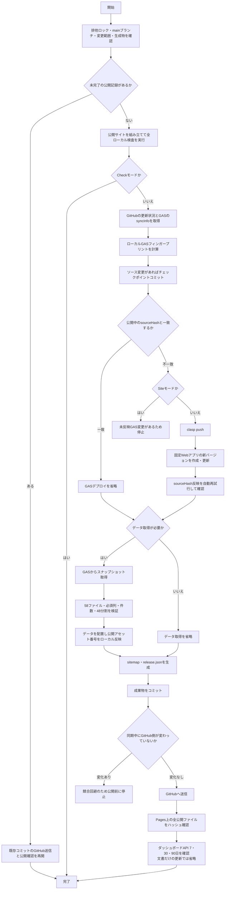

# sync-data 処理フロー

`sync-data.ps1` は、ローカル検査、必要なGAS更新、データ生成、GitHub Pages公開、公開後確認を一回の実行で行います。ブラウザーでの確認操作はありません。

## GASデプロイの判定

GASデプロイは毎回更新されません。`src/` にある実際のGAS実行ソースからSHA-256フィンガープリントを作り、公開中の固定Webアプリが `syncInfo` で返す `sourceHash` と比較します。

| 状況 | GASデプロイ | データ取得 |
| --- | --- | --- |
| 変更なしで通常実行 | 省略 | 実行 |
| `frontend/`、公開HTML、CSSだけを変更 | 省略 | 省略 |
| マニュアルだけを変更 | 省略 | 省略 |
| `src/` のGAS実行ソースを変更 | 更新 | 実行 |
| `-Mode Data` / `-Mode All` でGASが同一 | 省略 | 実行 |
| `-Mode Site` で未反映のGAS変更あり | 更新せず停止 | 実行しない |
| `-Mode Verify` | 更新しない | 再取得しない |

`manage_deploy.js`、`update_env.js`、自動生成される `sync_build.js` はフィンガープリントの対象外です。公開画面のアセット番号もローカルでHTMLへ反映するため、公開画面だけの変更でGAS版が増えることはありません。

GAS更新後の応答が一時的に404になる場合は自動再試行します。再実行時に期待する `sourceHash` がすでに公開されていれば、そのデプロイを再利用し、新しい版を作りません。
